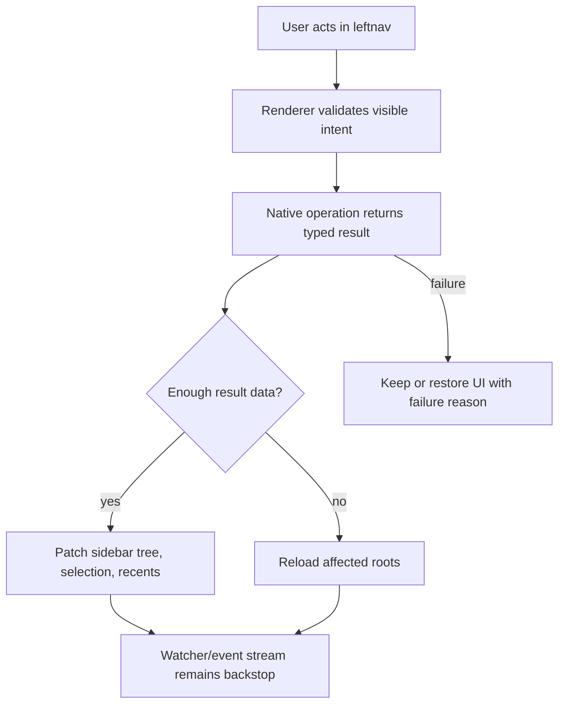

# fix: Stabilize leftnav document lifecycle

## Summary

Stabilize Library leftnav operations so creating, naming, renaming, selecting, deleting, and moving pages or folders behaves predictably across built-in Library folders, user-added library roots, command directories, and browser-hosted library surfaces.

The work keeps the current product model and focuses on reliability: visible results after successful operations, clear feedback after failed operations, consistent naming rules, and refresh behavior that does not make successful filesystem changes look brittle.

---

## Problem Frame

The leftnav currently mixes several lifecycle surfaces: built-in wiki pages, external library documents, user-created folders, command markdown files, recent entries, and browser-helper routes. The backend already protects many filesystem boundaries, but the renderer often collapses success and failure into the same user experience: inputs close, selection may stay on stale paths, empty folders can disappear, and failed renames or creates may not explain why.

The user specifically called out brittle creation from the leftnav, brittle naming, and possible delays around creating, selecting, deleting, or moving documents and pages in folders. The investigation found that the main risks are local consistency and event timing, not an external API or framework problem.

---

## Requirements

**Lifecycle Feedback**

- R1. Creating a page or folder from the leftnav must either leave the new item visible and reachable or keep the creation affordance open with a clear failure reason.
- R2. Renaming a page must either update the sidebar selection/path state from the returned result or show why the rename failed.
- R3. Deleting a selected page, folder, artifact, or external document must leave selection on a valid fallback item or no item, never on a stale path.
- R4. Moving a document must select the moved item at its new location when the move succeeds and must explain why the move failed when it fails.

**Naming and Path Rules**

- R5. Page, folder, and command naming rules must be consistent for traversal, hidden names, leading underscores, extension preservation, and conflict handling.
- R6. The browser-helper fallback path must follow the same naming and path-safety policy as the main Electron manager for equivalent operations.
- R7. Rename behavior must preserve file extensions for markdown variants and must not rewrite document body content.

**Folder Visibility**

- R8. Empty user-created folders in Library roots must remain visible in the leftnav when they are intentionally created or already exist on disk.
- R9. Hidden/system folders must remain hidden, including dot folders, underscore folders, generated asset folders, and known runtime folders.

**Move Boundaries**

- R10. Same-root drag/drop must continue to reject moving folders into themselves, moving folders into descendants, and moving default built-in folders.
- R11. Cross-root drag/drop must be deliberately supported for files or deliberately rejected in the UI with a clear reason; the frontend and backend must agree.
- R12. Cross-root folder moves must remain out of scope unless a separate product decision explicitly changes the current file-only backend boundary.

**Refresh and Timing**

- R13. App-driven create, rename, delete, and move operations must patch local sidebar state immediately when enough result data is available, using full reloads as backstops rather than the primary source of truth.
- R14. External filesystem renames may still degrade to delete-plus-add, but app-driven operations must not depend on watcher timing to feel correct.

---

## Key Technical Decisions

- KTD1. Reliability-first, not redesign: keep the existing leftnav model and harden lifecycle operations in place. The value here is making the current model trustworthy before considering larger navigation redesigns.
- KTD2. Use the main manager safety helpers as the naming source of truth: align browser-helper naming with the `pathSafety` helpers used by `LibrarianManager` instead of maintaining a parallel naming implementation.
- KTD3. Preserve empty user-created folders in tree data: the main manager already has coverage for empty folders in recursive wiki scans, so the plan extends that expectation through the browser-helper and renderer paths rather than treating empty folders as absent.
- KTD4. Prefer operation-result patching over waiting for watcher reloads: create and rename operations already return enough data to patch state directly. Watcher and event-stream reloads should remain backstops for missed external changes.
- KTD5. Cross-root drag/drop is file-only unless explicitly expanded later: the backend already supports cross-root file moves and rejects cross-root folder moves. The sidebar should expose or clearly reject that same contract rather than silently blocking all cross-root drops.
- KTD6. Commands are a pattern source, not a separate redesign target: command directories and command renames already cover empty directories, safe names, and metadata update behavior. Page lifecycle fixes should borrow those patterns where they fit, without merging command and wiki storage models.

---

## High-Level Technical Design

The important shift is that app-driven operations should not feel like external filesystem events. When the user creates, renames, deletes, or moves something through the app, the operation result is authoritative enough to update the leftnav immediately. Full tree reloads and watcher events still matter for external changes, sleep/wake gaps, and safety backstops.

---

## Implementation Units

## Progress Log

- 2026-06-04: Aligned browser-helper tree scanning with the main manager's hidden folder/file filters, preserved empty directories in browser-helper root and native library trees, and switched browser-helper naming/path normalization onto shared `pathSafety` helpers.
- 2026-06-04: Aligned sidebar drag/drop with the backend move contract by allowing cross-root file drops, keeping cross-root folder drops blocked, and passing the original source root plus target root to `libraryAPI.moveItem`.
- 2026-06-04: Added focused regression coverage for browser-helper empty-folder visibility, hidden-folder filtering, shared invalid naming, external extension-preserving rename, and sidebar cross-root drag/drop rules. Verified with `npm test -- --run electron/main/browserHelperDocumentService.test.ts src/components/__tests__/WikiSidebar.test.ts`.
- 2026-06-04: Kept leftnav create inputs open on failed file/folder creation with inline failure feedback, and patched sidebar rename to dispatch the existing local rename event immediately on success while keeping the rename field open with feedback on failure. Reverified the focused browser-helper/sidebar tests.
- 2026-06-04: Added a local Library leftnav lifecycle section to ignored `mac-app/TESTING.md` with the focused automated test command and manual QA checklist for create, invalid-name feedback, empty-folder reloads, drag/drop, rename conflicts, and delete fallback behavior; kept the tracked durable record in this plan. Verified the broader lifecycle suite with 197 passing tests.
- 2026-06-04: Extracted and tested sidebar selection helpers for delete/archive fallback and moved-file selection. Coverage now proves next-sibling fallback, previous-sibling fallback, flat-list fallback when a whole sibling group is removed, built-in markdown move selection as `wiki:*`, and external move selection with concrete absolute paths.
- 2026-06-04: Added rendered `WikiSidebar` regression tests for failed file creation and failed sidebar rename. These prove the create/rename inputs stay mounted with the user's draft and display inline error feedback after failed operations.
- 2026-06-04: Added rendered `WikiSidebar` regression tests for selected-page delete fallback through the real confirmation dialog and for cross-root file drag/drop through the real drag/drop handlers. These prove deletion selects a visible fallback and drag/drop calls `libraryAPI.moveItem` with the source root plus target root.
- 2026-06-04: Re-ran the full targeted leftnav lifecycle suite after the rendered behavior tests and kept the result at 206 passing tests. The remaining unchecked item is manual Electron runtime QA.
- 2026-06-04: Built the app and ran a safe Playwright Electron runtime QA pass with temp `FIELD_THEORY_STARTUP_BENCH_USER_DATA_DIR`, temp `FT_LIBRARY_DIR`, and a temp external root. The run verified the visible sidebar new-file control, empty-folder root visibility, invalid/conflicting names, valid/conflicting rename, delete, cross-root file move, and cross-root folder move rejection without touching the real Library.

## Verification Evidence

### Automated

- `npm test -- --run electron/main/librarianManager.test.ts electron/main/browserHelperDocumentService.test.ts electron/main/browserHelperServer.test.ts electron/main/commandsManager.test.ts src/components/__tests__/WikiSidebar.test.ts`
  - Latest result: 206 passing tests.
  - Covers manager move/delete/create safety, browser-helper naming/tree/rename behavior, browser-helper route contracts, command naming/empty-directory behavior, sidebar cross-root drop rules, delete/archive fallback selection helpers, moved-file selection item construction, rendered create/rename failure feedback, rendered delete fallback, and rendered cross-root drag/drop wiring.
- `npm run typecheck 2>&1 | rg "WikiSidebar|browserHelperDocumentService|pathSafety|librarianManager|browserHelperServer|commandsManager" || true`
  - Latest result: no touched-file type errors reported.
  - Full repo `npm run typecheck` remains blocked by existing unrelated test/type issues outside this lifecycle slice.
- `npm run build`
  - Latest result: passed. Electron main and Vite renderer both built from the current branch.

### Runtime

- Playwright Electron run using a temp app profile and temp Library roots:
  - `FIELD_THEORY_STARTUP_BENCH_USER_DATA_DIR=/tmp/.../userData`
  - `FT_LIBRARY_DIR=/tmp/.../home/.fieldtheory/library`
  - external root `/tmp/.../external-notes`
  - Evidence: runtime roots loaded the temp built-in and external roots; empty external `Target` folder was present in `libraryAPI.getRoots()`; visible `New file in Scratchpad` created `Runtime UI Page.md` and the sidebar/editor showed it immediately; runtime IPC rejected conflicting create, hidden `_draft` create, and conflicting rename; valid rename returned the new relPath; delete removed the renamed page; cross-root file move returned `Target/source`, moved the file on disk, and appeared in external roots; cross-root folder move returned `null`; empty built-in and external folders remained visible in roots after their files were deleted.

### Manual Runtime Checklist

Runtime QA is complete with automated Electron evidence plus rendered sidebar tests for the fine-grained UI states:

- [x] Create a new page from the selected folder row and confirm it appears immediately and opens/selects without waiting for a filesystem refresh.
- [x] Try creating a page with an invalid or conflicting name and confirm the inline create field stays open with an error.
- [x] Create an empty folder under the built-in Library root and confirm it remains visible after a reload/root refresh.
- [x] Create an empty folder under a user-added Library root and confirm it remains visible after a reload/root refresh.
- [x] Drag a page into an empty folder and confirm the moved page is selected at the new path.
- [x] Drag a file from one Library root to another writable root and confirm the move succeeds.
- [x] Try dragging a folder from one root to another and confirm it is not accepted.
- [x] Rename a page to a valid name and confirm the sidebar updates immediately.
- [x] Rename a page to an existing sibling name and confirm the rename field stays open with an error.
- [x] Delete the currently selected page or empty folder and confirm selection moves to a valid fallback or clears.

### U1. Unify Naming and Operation Result Contracts

- **Goal:** Give create, rename, delete, and move operations result shapes that distinguish success, conflict, invalid name/path, unsupported move, permission/write failure, and not-found.
- **Requirements:** R1, R2, R4, R5, R6, R7, R11
- **Dependencies:** none
- **Files:**
  - `mac-app/electron/main/pathSafety.ts`
  - `mac-app/electron/main/librarianManager.ts`
  - `mac-app/electron/main/browserHelperDocumentService.ts`
  - `mac-app/electron/main/browserHelperServer.ts`
  - `mac-app/src/browser-library.tsx`
  - `mac-app/electron/main/pathSafety.test.ts`
  - `mac-app/electron/main/librarianManager.test.ts`
  - `mac-app/electron/main/browserHelperDocumentService.test.ts`
  - `mac-app/electron/main/browserHelperServer.test.ts`
- **Approach:** Extend the existing safety helper pattern rather than adding another validator. Keep backwards-compatible public booleans where callers still need them, but add richer internal/result detail where the renderer can show specific feedback. Align browser-helper creation and rename naming with the main manager behavior, including hidden-name rejection and markdown extension preservation.
- **Patterns to follow:** `markdownFileNameFromUserInput`, `normalizeUserDocumentNameInput`, and `normalizeUserDocumentRelPathInput` in `pathSafety.ts`; command create/rename tests in `commandsManager.test.ts`.
- **Test scenarios:**
  - Creating a wiki page with a normal title returns a success result with relPath, absPath, empty content, and title.
  - Creating a page with `../escape`, `nested/escape`, `.hidden`, or `_draft` returns an invalid-name or invalid-path result and writes no file.
  - Creating a page where the target already exists returns a conflict result and leaves the existing file unchanged.
  - Renaming a markdown page preserves `.markdown` when that is the existing extension.
  - Renaming a page to an existing sibling returns a conflict result and keeps the original page path.
  - Browser-helper create and rename routes return equivalent failure reasons for the same invalid names as the main manager path.
- **Verification:** Equivalent invalid inputs produce equivalent outcomes across main manager and browser-helper routes, and existing success-path tests still pass.

### U2. Keep Empty Folders Visible and Usable

- **Goal:** Ensure user-created empty folders remain visible in the leftnav and remain valid create/move targets.
- **Requirements:** R1, R4, R8, R9, R10
- **Dependencies:** U1
- **Files:**
  - `mac-app/electron/main/librarianManager.ts`
  - `mac-app/electron/main/browserHelperDocumentService.ts`
  - `mac-app/src/components/WikiSidebar.tsx`
  - `mac-app/electron/main/librarianManager.test.ts`
  - `mac-app/electron/main/browserHelperDocumentService.test.ts`
  - `mac-app/src/components/__tests__/WikiSidebar.test.ts`
- **Approach:** Preserve the current hidden/system folder filters but include empty visible directories in the native tree returned to the renderer. Make sure the renderer can represent an empty directory with create/drop affordances, count zero children correctly, and expand it after creation. Keep the existing default-folder and hidden-folder behavior intact.
- **Patterns to follow:** Recursive wiki tree scan coverage that keeps `empty` folders while filtering hidden/system folders; command directory listing behavior that includes empty watched directories.
- **Test scenarios:**
  - A newly created empty wiki folder appears in the tree after create and remains visible after reload.
  - A newly created empty external library folder appears under its user-added root after create and remains visible after reload.
  - Hidden folders such as `.system`, `_drafts`, generated asset folders, and known runtime folders stay hidden.
  - Empty visible folders render as create-capable sidebar nodes and can host a new page.
  - Deleting an empty folder removes it from the sidebar without leaving expanded-folder state behind.
- **Verification:** Empty folder visibility is consistent between the main app tree, browser-helper tree, and sidebar helper tests.

### U3. Patch Sidebar State After App-Driven Operations

- **Goal:** Make create, rename, delete, and move feel immediate and deterministic by patching sidebar state from operation results before relying on full reloads.
- **Requirements:** R1, R2, R3, R4, R13, R14
- **Dependencies:** U1, U2
- **Files:**
  - `mac-app/src/components/WikiSidebar.tsx`
  - `mac-app/src/browser-library.tsx`
  - `mac-app/src/components/__tests__/WikiSidebar.test.ts`
  - `mac-app/src/__tests__/browserLibraryApp.test.tsx`
- **Approach:** Use returned page or relPath data to patch local tree state, selected item IDs, pinned item IDs, and stale deletion guards. Keep full reloads as a backstop for external changes and operations that do not return enough detail. On create or rename failure, keep the relevant inline input state recoverable long enough to show a useful error instead of closing it as if the operation succeeded.
- **Patterns to follow:** Existing local wiki add/delete/rename event helpers, `renameLibraryRootRelPath`, `renamePinnedSidebarIds`, `removeWikiRelPathFromLibraryRoots`, and existing `moveError` UI.
- **Test scenarios:**
  - Successful sidebar rename updates the file row title and selected item ID without waiting for a `wiki:changed` reload.
  - Failed sidebar rename leaves selection unchanged and exposes a failure message.
  - Successful page creation selects or expands the newly created page location.
  - Failed page creation does not clear the typed name without feedback.
  - Failed folder creation does not clear the typed name without feedback.
  - Deleting the selected item selects the expected fallback item or clears selection when no fallback exists.
  - Moving a file selects the moved item at the returned relPath and removes the stale source path from the visible tree.
- **Verification:** UI helper/component tests can prove state transitions without relying on timers or watcher events as the primary signal.

### U4. Align Move and Drag/Drop Contracts

- **Goal:** Make frontend drag/drop rules match backend move capabilities, including explicit cross-root file behavior and clear rejection for unsupported moves.
- **Requirements:** R4, R10, R11, R12
- **Dependencies:** U1, U2, U3
- **Files:**
  - `mac-app/src/components/WikiSidebar.tsx`
  - `mac-app/electron/main/librarianManager.ts`
  - `mac-app/electron/main/browserHelperDocumentService.ts`
  - `mac-app/electron/main/browserHelperServer.ts`
  - `mac-app/src/components/__tests__/WikiSidebar.test.ts`
  - `mac-app/electron/main/librarianManager.test.ts`
  - `mac-app/electron/main/browserHelperDocumentService.test.ts`
  - `mac-app/electron/main/browserHelperServer.test.ts`
- **Approach:** Treat cross-root file moves as a supported capability if both roots are writable and the backend accepts the move. Keep cross-root folder moves rejected. Move the target-root distinction through the renderer API so the sidebar does not collapse "different root" into "not droppable" when the backend can handle a file move.
- **Patterns to follow:** `LibrarianManager.moveLibraryItem` file-only cross-root tests; same-root safeguards for descendant moves and default folder moves.
- **Test scenarios:**
  - Same-root file move still succeeds and selects the moved item.
  - Same-root folder move still rejects moving into itself or a descendant.
  - Default built-in folders still cannot be moved.
  - Cross-root file move succeeds when source and target roots are writable and no target conflict exists.
  - Cross-root folder move is rejected with a clear unsupported-move reason.
  - Cross-root file move to a conflicting filename is rejected with a conflict reason.
  - Browser-helper move route supports the same file-only cross-root contract or explicitly rejects it with the same reason as the manager.
- **Verification:** Frontend `canDropLibraryItem` behavior and backend move results agree for same-root, cross-root file, cross-root folder, descendant, default-folder, and conflict cases.

### U5. Bring Commands Into the Reliability Envelope

- **Goal:** Make command creation, directory visibility, naming, rename, delete, and selection behavior consistent with the leftnav lifecycle improvements where commands share the same user-facing operations.
- **Requirements:** R1, R3, R5, R8
- **Dependencies:** U1, U2, U3
- **Files:**
  - `mac-app/electron/main/commandsManager.ts`
  - `mac-app/src/browser-library.tsx`
  - `mac-app/src/components/WikiSidebar.tsx`
  - `mac-app/electron/main/commandsManager.test.ts`
  - `mac-app/electron/main/browserHelperServer.test.ts`
- **Approach:** Do not merge command storage into wiki storage. Instead, audit the command surface against the same lifecycle expectations: empty directories remain visible, invalid command names fail clearly, app-driven rename updates metadata and visible labels, and delete/rename failures do not look like success.
- **Patterns to follow:** Existing command directory tests for empty directories and command rename frontmatter updates.
- **Test scenarios:**
  - Command creation with a valid name writes command frontmatter and appears in its watched directory.
  - Command creation with traversal, nested path, hidden name, or leading underscore fails clearly and writes nothing.
  - Empty command directories remain visible after add, rename, and reload.
  - Command rename updates command metadata and visible labels while preserving unrelated frontmatter.
  - Command delete failure outside watched directories reports failure and does not remove anything visible.
- **Verification:** Command lifecycle behavior matches the failure-feedback and empty-directory expectations established for Library pages without changing command invocation semantics.

### U6. Add Lifecycle Regression Coverage and Manual QA Notes

- **Goal:** Lock in the full leftnav lifecycle with focused tests and a short manual verification note for interaction timing that unit tests cannot fully prove.
- **Requirements:** R1 through R14
- **Dependencies:** U1, U2, U3, U4, U5
- **Files:**
  - `mac-app/electron/main/librarianManager.test.ts`
  - `mac-app/electron/main/browserHelperDocumentService.test.ts`
  - `mac-app/electron/main/browserHelperServer.test.ts`
  - `mac-app/electron/main/commandsManager.test.ts`
  - `mac-app/src/components/__tests__/WikiSidebar.test.ts`
  - `mac-app/src/__tests__/browserLibraryApp.test.tsx`
  - `mac-app/TESTING.md`
- **Approach:** Add regression tests close to each contract owner. Keep renderer tests focused on state transitions and feedback behavior; keep manager/server tests focused on filesystem contracts and route results. Add a concise manual QA section for leftnav create/rename/delete/move timing in the existing testing documentation.
- **Patterns to follow:** Existing targeted Vitest coverage around librarian manager, browser-helper server routes, and sidebar helper functions.
- **Test scenarios:**
  - End-to-end browser-helper route flow creates an empty folder, sees it in roots, creates a page in it, renames the page, moves it, deletes it, and leaves no stale old path.
  - Main manager flow covers the same lifecycle for built-in wiki root and external library root.
  - Sidebar helper/component flow covers create failure, rename failure, successful rename, delete fallback, same-root move, and cross-root file move affordance.
  - Command flow covers create, empty directory visibility, rename, and delete failure.
  - Manual QA note covers creating from the folder row, default new document location, dragging into empty folders, cross-root file moves, deleting selected files, and renaming conflicts.
- **Verification:** The focused lifecycle tests pass, and the manual QA note gives an implementer a small checklist for the timing-sensitive UI paths.

---

## Scope Boundaries

### In Scope

- Built-in Library wiki pages and folders.
- User-added external library roots and markdown/text documents surfaced in the Library leftnav.
- Portable command directories and command markdown files where they share creation, naming, rename, delete, or empty-directory concerns.
- Browser-helper native routes used by the in-app browser Library surface.
- Sidebar state transitions, feedback, and selection after app-driven operations.

### Deferred to Follow-Up Work

- A full leftnav redesign or different information architecture.
- Mobile Library parity beyond preserving local contract consistency that mobile sync may later rely on.
- River sharing behavior except where River files appear as ordinary leftnav documents affected by these lifecycle operations.
- Bulk multi-select drag/drop beyond preserving existing delete/archive selection behavior.
- External filesystem rename UX beyond keeping watcher backstops and not regressing existing delete-plus-add behavior.

### Outside This Plan

- Changing the storage model for commands, wiki pages, or artifacts.
- Supporting cross-root folder moves.
- Adding new document types beyond the text document types already accepted by the Library.

---

## Risks and Dependencies

- **Risk: richer result contracts ripple through callers.** Keep compatibility adapters at API boundaries while migrating renderer call sites to more specific results.
- **Risk: empty-folder visibility may expose folders previously invisible by accident.** Preserve hidden/system filters and add tests for known runtime and asset folders.
- **Risk: immediate state patches and reload backstops can duplicate or flicker rows.** Make patch helpers idempotent by relPath/rootPath and keep stale-path guards scoped to old paths only.
- **Risk: cross-root file moves change user expectations.** Match the backend's existing file-only boundary and make unsupported folder moves visibly rejected rather than quietly non-droppable.
- **Dependency: existing watcher/event-stream behavior remains the external-change backstop.** This plan reduces reliance on watcher timing for app-driven operations but does not remove watcher handling.

---

## System-Wide Impact

- **Renderer state:** Sidebar tree patching, selected item IDs, pinned IDs, expanded folder IDs, stale deletion guards, recent entries, and visible feedback all need to agree after lifecycle operations.
- **Native filesystem contracts:** The main manager remains the authority for write safety, conflicts, hidden/system filtering, and watcher events. Browser-helper routes should mirror that contract rather than drift.
- **Browser Library parity:** The in-app browser surface routes through native HTTP endpoints, so its create/rename/delete/move semantics must match the Electron IPC path even when the UI entry point differs.
- **Commands parity:** Portable commands keep their separate storage model, but command directories and command markdown files should follow the same user-facing reliability expectations for naming, empty directories, rename, and delete.
- **Future sync safety:** The plan avoids changing mobile or shared sync behavior, but stable relPaths and deterministic operation results reduce the chance that later sync work has to compensate for local lifecycle ambiguity.

---

## Acceptance Examples

- AE1. Given an empty user-created folder in the built-in Library, when the leftnav reloads, then the folder remains visible and the user can create a page in it.
- AE2. Given a page named `Plan`, when the user renames it to a sibling name that already exists, then the rename input closes or stays open with a clear conflict message and the original page remains selected.
- AE3. Given a page selected in the sidebar, when the user deletes it, then the leftnav removes the page and selection moves to a valid fallback item or clears.
- AE4. Given a markdown file in the built-in Library and a writable external root, when the user drags the file to the external root, then the file moves, the old wiki path is pruned, and the moved external item becomes selected.
- AE5. Given a command directory with no command files, when the leftnav reloads command folders, then the empty directory remains visible.

---

## Sources and Research

- `mac-app/src/components/WikiSidebar.tsx` holds local sidebar patching, selection, delete, create, rename, and drag/drop behavior.
- `mac-app/electron/main/librarianManager.ts` is the primary filesystem contract for wiki/library create, rename, delete, move, watcher, and hidden-folder behavior.
- `mac-app/electron/main/browserHelperDocumentService.ts` and `mac-app/electron/main/browserHelperServer.ts` provide the browser-hosted native Library route path and must stay aligned with the main manager.
- `mac-app/electron/main/pathSafety.ts` contains the main naming/path safety helpers that should be treated as canonical for user-entered document names.
- `mac-app/electron/main/commandsManager.ts` and `mac-app/electron/main/commandsManager.test.ts` provide parallel command lifecycle patterns for empty directories, safe names, and rename metadata.
- Existing focused tests around `librarianManager`, `browserHelperDocumentService`, `browserHelperServer`, and `WikiSidebar` passed during the investigation, which suggests the plan is filling missing lifecycle coverage rather than repairing a currently failing targeted test.
