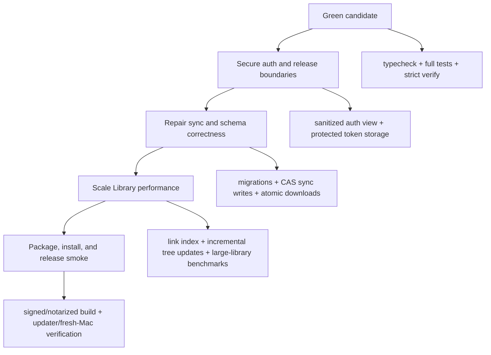

# Field Theory Release Readiness Remediation Plan

## Summary

This plan turns the experimental release audit into a sequenced remediation path for shipping Field Theory from `experimental` to `main` and then to a public Mac release. The plan is intentionally release-gated: every unit has a verification check, and no public build should ship until the release candidate is green on type safety, tests, security boundaries, sync correctness, packaging, and large-library performance.

---

## Progress - June 4, 2026

- U1 complete: `npm run typecheck` and the full `npm test` suite pass from `mac-app`.
- U2 complete: added `npm run verify:release` and `npm run verify:release:experimental`; the experimental verify command passes typecheck, full tests, and production dependency audit before correctly failing on the feature-branch release-channel guard.
- U3-U5 complete: renderer and Browser Helper auth session reads now return sanitized account state without Supabase tokens; session persistence migrates to `supabase-session.enc` via Electron `safeStorage`; Browser Helper external open uses the shared shell allowlist; notarization fails closed unless `FIELD_THEORY_ALLOW_UNSIGNED_NOTARIZATION_SKIP=true` is explicitly set.
- U6-U8 partially complete: migration prefixes are now unique and guarded by a test; River shared writes include the expected revision in the database update; private Library downloads use atomic writes and conflict copies. Private Library uploads still need a database-side compare-and-swap follow-up before broad public release.
- U9-U11 partially complete: image cache metadata is cached in memory and oversized persistent base64 blobs are dropped instead of parsed during render. Whole-Library backlink indexing, incremental tree updates, and rendered editor source-map caching remain larger follow-up work.
- U12-U14 partially complete: `npm run build`, package-safety, Electron dist require checks, and `git diff --check` pass. Full `npm audit --audit-level=high` remains red on Electron and developer-tooling advisories; this is documented as an experimental-build-only risk acceptance until the Electron/tooling upgrade track lands.

---

## Problem Frame

The current `experimental` tree can build and passes package-safety guards, but it is not public-release ready. The audit found red validation checks, token exposure risks, sync races that can lose user work, missing or ambiguous Supabase schema state, stale release documentation, and several large-library latency paths.

The release bar is higher than "the app launches." Field Theory is about trusting local notes, shared documents, command workflows, and sync. A public build must protect user tokens, avoid silent data loss, behave acceptably on a real large Library, and fail closed when release credentials or verification are missing.

---

## Requirements

**Release Gate**

- R1. The release candidate must pass `npm run typecheck` from `mac-app`.
- R2. The release candidate must pass the full Vitest suite from `mac-app`.
- R3. The packaging path must include or be preceded by a strict release verification command that fails when typecheck, tests, package guards, audit policy, or quality budgets fail.
- R4. `RELEASE_CHECKLIST.md` must match the current app version and distinguish automated evidence from manual release gates.

**Security and Privacy**

- R5. Renderer and Browser Helper surfaces must not receive raw Supabase sessions or refresh-token-bearing payloads.
- R6. Supabase refresh-token persistence must use an encrypted or OS-protected storage path, with any fallback metadata file using strict permissions and no refresh token.
- R7. Browser Helper external URL opening must use the same allowlist as the normal shell IPC path.
- R8. Public release packaging must fail closed when notarization credentials are missing, unless an explicit non-public override is set.
- R9. The release process must run a history-aware secret scan before public publication.

**Sync and Data Integrity**

- R10. The checked-in Supabase migrations must create and secure every table required by Mac and mobile sync, including `library_documents`.
- R11. Supabase migration identifiers must be unique and reproducible in a fresh database.
- R12. River shared document saves must use compare-and-swap semantics so concurrent edits cannot silently overwrite each other.
- R13. Private library sync uploads must not overwrite newer remote content after a stale preflight read.
- R14. Remote sync downloads must write markdown files atomically and preserve a recoverable copy on conflict or write failure.

**Latency and Scale**

- R15. Library backlink and linked-document behavior must not require loading every document body into the renderer for normal editing.
- R16. Library watcher events must not routinely force full synchronous root rescans for ordinary add, change, delete, or rename events.
- R17. Rendered editor source mapping must avoid rebuilding full DOM/source maps on common caret and selection interactions for large documents.
- R18. Release performance checks must include a Library-scale fixture or benchmark comparable to an 8k-document Library.

---

## Key Technical Decisions

- KTD1. Treat failing validation as release-blocking, not advisory: The branch is allowed to build while still being unsafe to publish. `typecheck`, full tests, and strict release verification are the first gate because they prevent hidden drift while security and sync work proceeds.
- KTD2. Keep tokens main-process only: Renderer code can know that the user is authenticated, who they are, and what product state applies. It should not hold refresh tokens or raw provider sessions.
- KTD3. Use database-side concurrency for shared and synced documents: Client-side compare-then-update is not enough. The database write must include the expected revision, timestamp, or content hash and return a conflict when the remote changed.
- KTD4. Make schema reproducibility part of release readiness: A live production table is not enough if the checked-in migrations cannot create the same shape. Public release should be rebuildable from repo state plus documented secrets.
- KTD5. Index Library relationships outside the typing hot path: Backlinks and linked documents are useful, but they should be served from an incremental index or bounded query, not rebuilt by loading thousands of documents in the renderer.
- KTD6. Release packaging should fail closed: Local convenience can stay available through explicit opt-outs, but public packaging must fail when notarization, audit policy, tests, or required manual gates are missing.

---

## High-Level Technical Design

The work should land in four release stabilization passes.

The ordering matters. First make the candidate mechanically green so later changes can be judged. Then secure the token and packaging boundaries before public distribution. Then fix data-loss risks before inviting real user notes into sync. Then take the large-library performance work far enough that public users do not immediately hit stalls. Finish with real packaged-build validation.

---

## Implementation Units

### U1. Make the Release Candidate Green

- **Goal:** Clear the current red validation state and make red checks impossible to bypass accidentally.
- **Files:** `mac-app/src/browser-library.tsx`, `mac-app/src/command-launcher.tsx`, `mac-app/src/components/CommandsView.tsx`, `mac-app/src/components/LibrarianView.tsx`, `mac-app/src/services/bookmarksCache.test.ts`, `mac-app/src/__tests__/libraryView.test.ts`, `mac-app/src/components/WikiSidebar.tsx`, `mac-app/package.json`.
- **Patterns:** Keep fixes narrow. For test failures, decide intended behavior first, then align implementation and tests. For TypeScript errors, prefer tightening local types and mocks over widening API types.
- **Test Scenarios:**
  - `npm run typecheck` passes from `mac-app`.
  - `npm test` passes from `mac-app`.
  - The Library drag/drop case rejects built-in wiki file moves into external roots if that is the intended policy.
  - Any changed test mock still matches the real preload/window API type.
- **Verification:** `npm run typecheck`, `npm test`, `git diff --check`.

### U2. Add a Strict Release Verification Command

- **Goal:** Create one release command that fails when the release is not actually ready, and wire documentation around it.
- **Files:** `mac-app/package.json`, `mac-app/scripts/quality-baseline.mjs`, `mac-app/scripts/check-package-safety.mjs`, `mac-app/docs/RELEASE_WORKFLOW.md`, `mac-app/docs/RELEASE_CHECKLIST.md`.
- **Patterns:** Reuse existing guards instead of inventing a parallel release system. Keep packaging and verification separate enough that a developer can run verification without producing artifacts.
- **Test Scenarios:**
  - The strict verification command fails when `npm run typecheck` fails.
  - The strict verification command fails when `npm test` fails.
  - The strict verification command includes package safety, tracked-source, Electron dist require, audit policy, and quality budget checks.
  - `package:experimental` either invokes the strict verification command or the release docs make it a required preceding gate.
- **Verification:** Run the new strict verification command once red before fixes, then again green after the remediation units land.

### U3. Stop Raw Session Exposure

- **Goal:** Replace raw Supabase session exposure with a sanitized auth state contract.
- **Files:** `mac-app/electron/main/index.ts`, `mac-app/electron/main/authManager.ts`, `mac-app/electron/main/browserHelperServer.ts`, `mac-app/electron/preload.ts`, `mac-app/src/types/window.d.ts`, auth-related tests under `mac-app/electron/main/*.test.ts` and `mac-app/src/**/__tests__`.
- **Patterns:** Main process owns tokens. Renderer and Browser Helper receive only durable user-facing auth state: authenticated boolean, user id, email or callsign, plan/tier state, expiry, and capability booleans.
- **Test Scenarios:**
  - `auth:getSession` no longer returns `access_token` or `refresh_token`.
  - `session-changed` renderer events do not include raw session tokens.
  - Browser Helper `/native/auth/session` no longer returns raw tokens.
  - Existing UI behavior for signed-in state, quota state, and callsign display still works.
- **Verification:** Targeted auth/session tests, `npm run typecheck`, `npm test -- --run` for affected auth and Browser Helper tests.

### U4. Protect Session Persistence

- **Goal:** Move refresh-token-bearing persistence out of plaintext JSON.
- **Files:** `mac-app/electron/main/authManager.ts`, `mac-app/electron/main/authManager.test.ts`, `mac-app/docs/SECURITY.md` if present, `mac-app/docs/RELEASE_WORKFLOW.md`.
- **Patterns:** Prefer macOS Keychain or Electron `safeStorage`. Keep migration logic for existing `supabase-session.json` users, then remove or rewrite the plaintext token file after successful protected storage.
- **Test Scenarios:**
  - Existing plaintext session data migrates into protected storage.
  - A new login does not leave refresh-token-bearing JSON on disk.
  - Sign-out clears protected storage and any fallback metadata.
  - If protected storage is unavailable, the app fails safely or stores only non-token metadata with strict permissions.
- **Verification:** Unit tests for storage migration and clearing, manual local login/logout smoke test, targeted grep proving refresh tokens are not written to `supabase-session.json`.

### U5. Close Browser Helper Shell and Notarization Gaps

- **Goal:** Make external URL opening and public notarization fail closed.
- **Files:** `mac-app/electron/main/browserHelperServer.ts`, `mac-app/electron/main/index.ts`, `mac-app/electron/main/shellIpc.ts`, `mac-app/scripts/notarize.js`, `mac-app/package.json`, `mac-app/docs/RELEASE_WORKFLOW.md`.
- **Patterns:** Reuse `isAllowedExternalShellUrl` rather than duplicating URL policy. Keep local unsigned builds possible only through an explicit local override.
- **Test Scenarios:**
  - Browser Helper rejects `file:`, custom unsafe schemes, and malformed URLs for open-external behavior.
  - Browser Helper allows `https:`, `http:`, `mailto:`, and allowed Apple Settings URLs consistently with shell IPC.
  - Public release packaging fails when Apple notarization env vars are missing.
  - Explicit local override still allows non-public packaging when documented.
- **Verification:** Targeted Browser Helper and shell IPC tests, dry-run packaging/notarization script checks where possible.

### U6. Repair Supabase Migration Reproducibility

- **Goal:** Make the sync schema reproducible from checked-in migrations.
- **Files:** `supabase/migrations/*.sql`, `mac-app/electron/main/librarySyncService.ts`, `services/sync.ts`, migration tests or scripts under the existing test/CI location.
- **Patterns:** Add migrations rather than relying on manually applied production state. Avoid rewriting applied migration history unless the repo already has an established repair process.
- **Test Scenarios:**
  - A checked-in migration creates `library_documents` with expected columns, unique constraints, indexes, RLS, insert/update/delete policies, and tombstone behavior.
  - Migration filename prefixes are unique.
  - A disposable fresh database can apply migrations without collision.
  - Mac and mobile sync table assumptions match the resulting schema.
- **Verification:** Migration prefix guard, Supabase local reset/apply against a disposable database, targeted schema assertions.

### U7. Make River Shared Saves Conflict-Safe

- **Goal:** Prevent concurrent River edits from silently overwriting each other.
- **Files:** `mac-app/electron/main/sharedSyncService.ts`, `mac-app/electron/main/sharedSyncService.test.ts`, `supabase/migrations/016_team_documents.sql` or a new follow-up migration/RPC file.
- **Patterns:** Use compare-and-swap at the database boundary. Either add `.eq('revision', expectedRevision)` and detect zero updated rows, or move the write into an RPC that checks and increments revision atomically.
- **Test Scenarios:**
  - Two writes starting from the same revision cannot both succeed.
  - A stale write returns a conflict with remote content and a local conflict copy.
  - A fresh write increments revision exactly once.
  - Deleted shared documents cannot be updated.
- **Verification:** Targeted shared sync tests plus Supabase RPC or query behavior test.

### U8. Make Private Library Sync Conflict-Safe and Atomic

- **Goal:** Prevent private sync from overwriting newer remote edits or truncating local files during downloads.
- **Files:** `mac-app/electron/main/librarySyncService.ts`, `mac-app/electron/main/librarySyncService.test.ts`, `mac-app/electron/main/documentSaveGuard.ts`.
- **Patterns:** Use conditional remote writes keyed by observed timestamp/hash or a database RPC. Reuse `writeTextFileAtomically` for local downloads and preserve backup/conflict copies when hashes differ.
- **Test Scenarios:**
  - If remote content changes after preflight, local upload returns conflict instead of upserting.
  - Remote download write failure leaves the original local markdown intact.
  - Remote download conflict writes a recoverable local copy.
  - Tombstone behavior does not erase newer remote edits.
- **Verification:** Targeted library sync tests, forced write-failure test, manual two-device or simulated concurrent sync smoke.

### U9. Replace Whole-Library Link Loading With an Index

- **Goal:** Remove all-document body loading from normal Library and Commands editing paths.
- **Files:** `mac-app/src/components/LibrarianView.tsx`, `mac-app/src/components/CommandsView.tsx`, `mac-app/src/utils/wikiLinks.ts`, `mac-app/electron/main/librarianManager.ts`, possible new main-process index module under `mac-app/electron/main/`.
- **Patterns:** Build and maintain link metadata in the main process or SQLite. Query outbound links for the active document immediately and backlinks asynchronously from the index.
- **Test Scenarios:**
  - Opening a document does not trigger `getPage` or `getReading` for every indexed document.
  - Backlinks remain correct after save, rename, delete, and watcher events.
  - Commands markdown and artifact backlinks still resolve.
  - Large Library fixture stays within release latency budget for first editable document and linked-doc refresh.
- **Verification:** Unit tests for index updates, component tests for linked-doc rendering, `quality:baseline` with an 8k-document fixture.

### U10. Make Library Tree Updates Incremental

- **Goal:** Stop ordinary file events from causing full synchronous tree rebuilds.
- **Files:** `mac-app/electron/main/librarianManager.ts`, `mac-app/src/components/WikiSidebar.tsx`, related sidebar tests under `mac-app/src/components/__tests__/WikiSidebar.test.ts`.
- **Patterns:** Keep full scans for cold start and repair. Patch cache state for add/change/unlink/rename events. Coalesce noisy watcher events with bounded reconciliation.
- **Test Scenarios:**
  - Adding a markdown file patches the relevant root without full rescan.
  - Deleting a markdown file removes only the affected node.
  - Renaming a folder updates children and pins without full reload.
  - Noisy watcher bursts coalesce into one bounded reconciliation.
- **Verification:** Targeted Librarian Manager and Wiki Sidebar tests, large Library sidebar load benchmark.

### U11. Harden Rendered Editor and Image Hot Paths

- **Goal:** Reduce large-document interaction cost and image-heavy render cost.
- **Files:** `mac-app/src/utils/renderedMarkdownEditor.ts`, rendered editor tests in `mac-app/src/__tests__/libraryView.test.ts` and `mac-app/src/components/__tests__/LibrarianView.test.tsx`, `mac-app/src/utils/imageCache.ts`.
- **Patterns:** Cache rendered source maps per document version. Invalidate on content changes. Move image persistence away from one large localStorage JSON blob.
- **Test Scenarios:**
  - Caret resolution reuses cached source maps for unchanged rendered content.
  - Paste, delete, selection, and task toggles still map to correct Markdown source.
  - Large rendered documents stay inside interaction latency budget.
  - Image cache lookup does not synchronously parse a large base64 metadata blob during render.
- **Verification:** Existing rendered editor tests, added large-document performance test, image cache unit tests.

### U12. Upgrade or Gate Electron Runtime Advisories

- **Goal:** Resolve the release-relevant Electron audit posture.
- **Files:** `mac-app/package.json`, `mac-app/package-lock.json`, native rebuild scripts, Electron main/preload tests.
- **Patterns:** Prefer upgrading Electron to a supported non-vulnerable line. If a full upgrade is too risky for the immediate release, document an explicit temporary acceptance decision and narrow the public release blast radius.
- **Test Scenarios:**
  - `npm audit --audit-level=high` no longer reports release-relevant Electron runtime advisories, or the remaining advisories are documented as non-shipping/dev-only with rationale.
  - Native modules rebuild successfully.
  - Main process, preload, Browser Helper, node-pty, better-sqlite3, updater, and packaging still work.
- **Verification:** `npm audit --audit-level=high`, `npm run build`, `npm test`, package smoke test, installed app smoke test.

### U13. Refresh Release Checklist and Manual Gates

- **Goal:** Make release docs match `0.2.9` and current public-build reality.
- **Files:** `mac-app/docs/RELEASE_CHECKLIST.md`, `mac-app/docs/RELEASE_WORKFLOW.md`, `mac-app/README.md` if contributor/release boundaries need clarification.
- **Patterns:** Separate automated checks from manual checks. Mark every manual gate with the expected evidence, not just a checkbox.
- **Test Scenarios:**
  - Checklist version matches `mac-app/package.json`.
  - Checklist includes typecheck, full tests, strict release verify, audit policy, secret scan, package, notarization, updater, fresh-Mac install, auth, Library edit/save, sync, River, rollback, and website/release-notes gates.
  - Maintainer-only credentials remain documented as required but not exposed.
- **Verification:** Doc review against current scripts and package config.

### U14. Final Packaged Release Validation

- **Goal:** Prove the public build works as an installed app, not just as source.
- **Files:** No primary code files unless validation reveals defects; docs updated in `mac-app/docs/RELEASE_CHECKLIST.md`.
- **Patterns:** Validate the artifact users will install. Do not infer updater, notarization, permissions, or first-run behavior from dev mode.
- **Test Scenarios:**
  - Signed and notarized experimental package builds successfully.
  - Fresh Mac profile can install, launch, sign in, open Library, edit/save a note, and relaunch without losing state.
  - Updater detects a newer experimental release and performs the expected update flow.
  - River shared save and private library sync pass manual smoke without data loss.
  - Large Library fixture opens to first editable document inside agreed release budget.
- **Verification:** Completed release checklist with command output, artifact hash, installed app version, updater result, and manual smoke notes.

---

## Scope Boundaries

- This plan targets release-readiness remediation for the Mac app and shared sync surfaces required before a public build.
- It does not redesign Field Theory's product model, pricing, onboarding, website copy, or long-term sync architecture beyond what is needed to avoid release-blocking risk.
- It does not require every performance improvement to be perfect before release. It requires the known whole-library hot paths to stop blocking ordinary use at current Library scale.
- It does not require shipping public release artifacts automatically. Manual merge, release, deploy, SQL, and publication decisions remain maintainer-controlled.

---

## System-Wide Impact

This work changes core trust boundaries: renderer auth state, Browser Helper native APIs, local token storage, Supabase migrations, River saves, private Library sync, Library indexing, release verification, and packaging. It should be handled as a release stabilization track rather than mixed into feature work.

The biggest operational change is that release verification becomes a hard gate. A package should not be considered publishable just because Electron Builder can produce a DMG.

---

## Risks and Dependencies

| Risk | Impact | Mitigation |
| --- | --- | --- |
| Electron upgrade breaks native modules or packaging | Delays release | Isolate Electron upgrade, run native rebuild and packaged smoke early |
| Token storage migration logs users out | Support burden and trust hit | Add migration tests and manual login/logout smoke before release |
| Production Supabase schema differs from migrations | Sync works locally but fails or diverges elsewhere | Compare live schema to checked-in migrations before writing repair migration |
| Compare-and-swap sync changes surface more conflicts | Users see conflict copies instead of silent overwrites | Prefer visible conflict over data loss; document recovery behavior |
| Link indexing scope grows | Delays release | Start with markdown link/backlink metadata only; defer richer graph features |
| Strict release command becomes too slow | Developers bypass it | Keep fast local checks separate from full public-release verification |

---

## Acceptance Examples

- AE1. Given the release branch is checked out, when a maintainer runs strict release verification, then the command fails if `npm run typecheck` or `npm test` fails.
- AE2. Given a signed-in user, when renderer code requests auth state, then the response contains no `access_token` or `refresh_token`.
- AE3. Given two River clients editing revision 1, when both try to save different content, then only one succeeds and the other receives a conflict.
- AE4. Given private sync fetched remote row A, when another device updates that row before local upload, then the local upload does not overwrite the newer remote content.
- AE5. Given a remote download write fails mid-write, when the app restarts, then the original local markdown file is still intact or a recoverable backup exists.
- AE6. Given an 8k-document Library, when a user opens a note and types, then linked-doc and sidebar work do not require loading every document body in the renderer.
- AE7. Given public release packaging without Apple notarization credentials, when the packaging script reaches notarization, then it fails unless an explicit local-only override is set.
- AE8. Given a fresh Mac profile, when the packaged app is installed, launched, signed in, edited, synced, updated, and relaunched, then no release checklist gate remains unverified.

---

## Documentation and Operational Notes

`mac-app/docs/RELEASE_CHECKLIST.md` should become the operational release artifact. It should include exact command outputs or short evidence notes for every automated and manual gate.

`mac-app/docs/RELEASE_WORKFLOW.md` should explain the difference between local packaging, experimental private release, and public Field Releases publication. It should also state which command is the strict release verifier.

If schema repair requires manual Supabase work, keep the SQL and verification query in the repo before asking a maintainer to run it. The release should not depend on chat-only SQL.

---

## Sources and Research

- Audit origin brief: `~/.fieldtheory/library/briefs/Field Theory Experimental Release Audit Brief.md`.
- Validation commands and failures: `npm run typecheck`, `npm test`, `npm run build`, `npm audit --audit-level=high`, `npm run quality:baseline:checks`.
- Current release scripts: `mac-app/package.json`.
- Current release docs: `mac-app/docs/RELEASE_CHECKLIST.md`, `mac-app/docs/RELEASE_WORKFLOW.md`.
- Auth/session boundary references: `mac-app/electron/main/index.ts`, `mac-app/electron/main/authManager.ts`, `mac-app/electron/main/browserHelperServer.ts`, `mac-app/electron/preload.ts`.
- Sync references: `mac-app/electron/main/librarySyncService.ts`, `mac-app/electron/main/sharedSyncService.ts`, `mac-app/electron/main/documentSaveGuard.ts`, `services/sync.ts`, `supabase/migrations/016_team_documents.sql`.
- Performance references: `mac-app/src/components/LibrarianView.tsx`, `mac-app/src/components/CommandsView.tsx`, `mac-app/src/components/WikiSidebar.tsx`, `mac-app/src/utils/wikiLinks.ts`, `mac-app/src/utils/renderedMarkdownEditor.ts`, `mac-app/src/utils/imageCache.ts`.
