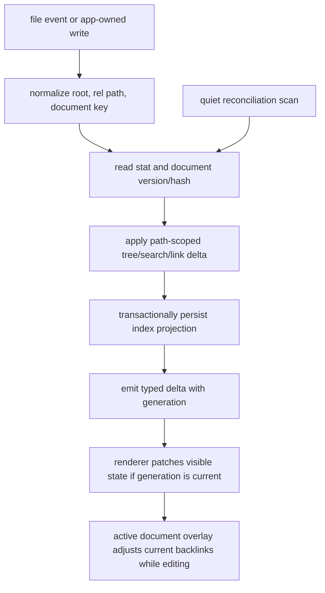
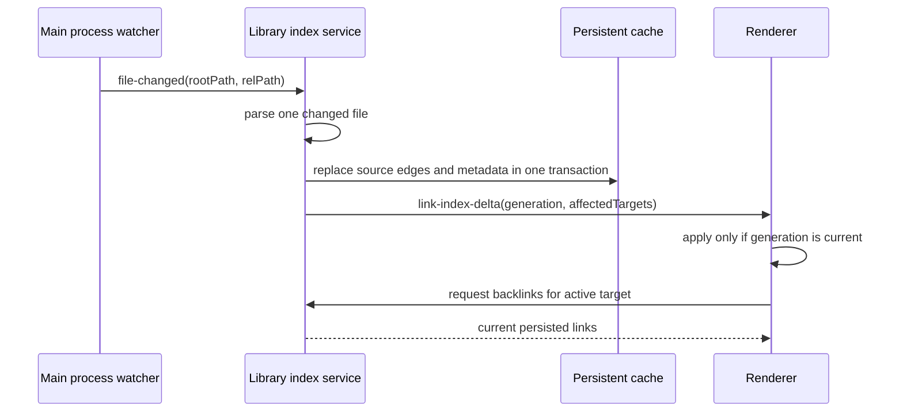

# perf: Add incremental Library indexing

## Summary

Build an incremental Library indexing path that keeps backlinks, tree state, search metadata, and rendered-editor link context fresh without making small file changes trigger whole-Library work. The design keeps Markdown files as the source of truth, treats indexes as rebuildable projections, and preserves full scans as quiet reconciliation rather than the normal hot path.

**Progress - June 4, 2026**

- U1 started with the user-critical sidebar and recent-work surfaces. `WikiSidebar` now ignores stale async tree, artifact, recent, tagged-doc, and shared-pin refreshes when a newer request has already started.
- Added focused tests proving an older tree reload cannot snap the sidebar back after newer state appears, and an older recent-work refresh cannot replace newer recent entries.
- U2 started with file-level deltas. Watcher-backed wiki and Library file changes now carry a `file-changed` payload through the main process, preload, browser helper events, and renderer types.
- App-owned file creation and watcher-backed file additions now emit `file-added` payloads immediately, so newly created or externally added files can appear without waiting for a broad tree reload.
- App-owned wiki deletes, app-owned external Library markdown deletes, and known watcher unlinks now emit `file-deleted` payloads. The sidebar patches known file deletes directly, including external Library roots, instead of waiting on full root reloads.
- The sidebar now patches file-added, file-deleted, and content-only file metadata deltas instead of reloading the whole tree. This keeps visible title, todo, archive, share, and timestamp metadata fresh while avoiding broad scans. Ambiguous old-style change events and directory deletes still trigger the existing repair reload path.
- Recent updates now broadcast the updated recent-entry list and the sidebar consumes it directly, avoiding an extra `recent:list` round trip after visits/removes.
- Browser Library event shims now unwrap `wiki:changed`, `library:changed`, and `recent:changed` payloads so browser surfaces can use the same low-latency path as native.
- Successful file moves now select the moved file immediately and run tree reload/expansion as follow-up repair, so a slow reload cannot block selection feedback.
- Same-root app-owned moves now emit the existing rename event immediately, letting renderer consumers patch paths before the broad repair reload finishes. Cross-root moves still use the repair path until the delta model grows explicit two-root move semantics.
- Command Launcher background loaders for Library markdown, artifact readings, recent entries, bookmark authors, and bookmark posts now ignore stale async completions when a newer refresh has started. This keeps near-real-time recent work and file-operation state from snapping backward after a slow background refresh finishes.
- Repair reloads now reuse parsed Markdown metadata for unchanged files within the main-process lifetime. The tree walk still checks filesystem state, but unchanged files skip body reads when mtime and size match, reducing full-repair cost without weakening freshness.
- Added a rebuildable `library-index.db` metadata cache for stat-matched Library document metadata. It persists title/todo/archive/share/edit metadata, not document bodies, so repair reloads after restart can skip body reads for unchanged Markdown while still falling back to disk if the cache is missing or unavailable.
- Updated local data/privacy docs to include `library-index.db`, its Application Support location, its rebuildable-cache role, and the fact that it excludes full document bodies.
- Extracted raw Markdown link-hit parsing into `electron/shared/wikiLinkParser.ts` so the future main-process link-edge index can use the same parser shape as the renderer without pulling React or renderer state into Electron main. Renderer wiki-link behavior remains covered by existing tests.
- `library-index.db` now has rebuildable raw link-hit rows keyed by source document path. When a changed Markdown body is already read for metadata, the manager also refreshes raw link hits; stat-matched cache reads do not reread or rewrite link hits.
- The link-hit cache now exposes indexed lookup helpers for selected source documents, normalized raw wikilink target text, and external hrefs. This gives the next backlink/outbound-link wiring a cache-backed read path without changing current renderer behavior.
- The selected-source link-hit lookup now uses chunked batched SQLite reads instead of one query per file, so future backlink/outbound wiring does not introduce an N-query relation path.
- App-owned wiki saves now emit a typed `file-changed` delta with fresh page metadata instead of a bare repair event, keeping normal save flows off the broad sidebar reload path.
- Rename, directory delete, and directory move paths now evict stale `library-index.db` rows for old source files, including child files under moved or deleted folders. This prevents future cache-backed backlink reads from returning deleted or pre-rename source paths.
- Sidebar folder creation now inserts the new directory optimistically after successful creation and leaves full tree reload as background repair. Launcher moves now open the moved file before refreshing Library markdown search rows in the background.
- `WikiSidebar` now ignores the duplicate built-in `library:changed` compatibility payload after handling the corresponding `wiki:changed` delta, avoiding a second patch or repair check for one user-visible wiki save/add/delete.
- Command Launcher now applies `recent:changed` payloads directly when the main process includes the updated recent list, avoiding an extra `recent:list` IPC after recent visits/removals while preserving the old list fallback for payload-less events.
- Command Launcher now patches Library markdown and directory rows from typed file add/change deltas when page metadata is present, avoiding a full `library:getRoots` reload for simple file updates. File deletes, generated bookmark taxonomy files, payload-less events, and ambiguous root changes stay on the full repair path so directory rows and bookmark facet rows cannot go stale.
- Browser-helper event coalescing now drops stale recent-entry payloads when the latest coalesced `recent:changed` event is payload-less, so browser/launcher surfaces fall back to a fresh recent list instead of applying old entries.
- Librarian linked-document computation now reads from an identity-checked 180ms debounced content snapshot. Typing and rendered editing update editor/save state immediately, while the expensive backlinks/outbound-link relation scan runs after the short debounce; document switches fall back to the new document content immediately so prior-file links cannot flash under the new selection.
- Shared-file sync scheduling is now debounced from Library change events, matching the existing Library sync debounce posture so edit bursts coalesce into background sync work.
- Verification: `npm test -- --run src/__tests__/browserLibraryUtils.test.ts electron/shared/wikiLinkParser.test.ts src/__tests__/wikiLinks.test.ts electron/main/libraryIndexStore.test.ts src/components/__tests__/WikiSidebar.test.ts electron/main/librarianManager.test.ts electron/main/browserHelperServer.test.ts src/__tests__/commandLauncherUtils.test.ts` passes with 441 tests. `tsc -p tsconfig.electron.json --noEmit` passes. Full `npm run typecheck` remains red on the current `origin/experimental` baseline in unrelated files; no new `WikiSidebar`, Command Launcher, or Electron type errors remain.

---

## Problem Frame

Field Theory's current Library experience already has pieces of the right model: watcher events, tree caches, local sidebar patches, stat-gated tagged-doc scans, and bounded search warming. The remaining large-Library risk is that several freshness paths still collapse to broad invalidation. The most expensive example is link relation computation in `mac-app/src/components/LibrarianView.tsx`, where the renderer loads wiki pages, artifacts, and commands, then parses link hits across the relation set.

That shape preserves correctness, but it does work proportional to Library size. The target behavior is work proportional to the changed file, with user-visible freshness preserved by immediate local patches, active-document overlays, generation guards, and background repair scans.

---

## Requirements

**Freshness and correctness**

- R1. A file add, change, delete, or rename updates only the affected tree nodes, search rows, and link edges on the fast path.
- R2. Backlinks and outbound links remain visibly current for the active document, including unsaved edits after a short debounce.
- R3. Full scans remain available as startup, idle, burst, sleep/wake, and explicit repair reconciliation.
- R4. Missed watcher events converge through stat-gated reconciliation without blocking opening, typing, sidebar navigation, or launcher search.

**Performance and UX**

- R5. Small file changes must avoid whole-Library content parsing in the renderer.
- R6. Sidebar and launcher state must not snap back because an older async load finishes after a newer one.
- R7. Search warming should prioritize recent, pinned, current-folder, command, and visible rows before deeper Library rows.
- R8. App-owned writes should not produce duplicate visible refreshes when the file watcher reports the same write shortly afterward.
- R13. Recent work, create, move, rename, and delete paths must feel near-real-time. The hot path should update visible state from the known operation or watcher delta first, then run full repair work quietly afterward.

**Architecture and privacy**

- R9. The main process owns durable index freshness, generations, and invalidation decisions.
- R10. React consumes snapshots, deltas, and active-document overlays; it does not own the durable Library index.
- R11. Persistent indexes store rebuildable metadata and link edges, not full document bodies unless a later explicit decision justifies that expansion.
- R12. Any new persisted index storage must be documented in the local data/privacy docs before public release.

---

## Key Technical Decisions

- KTD1. **Main-process index authority:** `LibrarianManager` or a sibling main-process service should own generations, watcher normalization, persistent ledger writes, and reconciliation. The renderer can cache snapshots, but the filesystem truth boundary belongs in the main process.
- KTD2. **Delta first, scan second:** watcher and app-write paths should emit typed file-level deltas. Broad `wiki:changed` and `library:changed` events remain repair signals, not the normal response to known file paths.
- KTD3. **Generation-guarded UI commits:** async renderer refreshes need monotonic request or generation checks before committing state. This prevents stale `getTree()` or background launcher loads from overwriting newer local patches.
- KTD4. **Rebuildable SQLite-backed projections:** the durable index should follow the existing tagged-doc pattern: scan in pure code or worker code, then apply results transactionally in the main process. The database is cache, not truth.
- KTD5. **Active-document overlay:** while editing, the active document's in-memory links should be parsed on debounce and overlaid on the persisted graph for current-pane backlinks/outbound links. Disk index updates wait for save or watcher confirmation.
- KTD6. **Hot-slice warming:** search and metadata warming should prefer the user's likely next actions over complete eager indexing. Recent documents, pinned items, current folder, open document, commands, and visible sidebar rows get priority.
- KTD7. **User-visible operation first:** app-owned create, move, rename, delete, and recent-work updates should never wait on a full Library scan before giving feedback. The broad scan is a safety net, not the UI path.

---

## High-Level Technical Design





The fast path is O(changed file). The repair path is O(number of files for stat checks) and O(changed files for parsing). Whole-document parsing across the Library should move out of renderer hot paths.

---

## Scope Boundaries

### In Scope

- File-level Library and wiki delta events.
- Generation guards for stale async UI commits.
- A persisted document ledger and link-edge graph.
- Active-document link overlays for rendered Markdown.
- Search and launcher warming changes that use index freshness instead of full renderer arrays.
- Privacy documentation for new persisted metadata.

### Deferred to Follow-Up Work

- Replacing all launcher search ranking with a full query engine.
- Moving image metadata from localStorage to IndexedDB or disk unless image-heavy validation shows it is now the bottleneck.
- Electron upgrade work needed for public release audit posture.
- Public-release packaging and updater policy changes.

### Out of Scope

- Changing Markdown link syntax or backlink product behavior.
- Persisting full document bodies in the index.
- Removing full scans entirely.

---

## Implementation Units

### U1. Add Generation Guards To Existing Async Refreshes

**Goal:** Prevent stale async work from overwriting newer Library UI state before deeper indexing changes land.

**Requirements:** R6, R8, R10

**Dependencies:** None

**Files:**

- `mac-app/src/components/WikiSidebar.tsx`
- `mac-app/src/command-launcher.tsx`
- `mac-app/electron/main/taggedDocsManager.ts`
- `mac-app/src/components/__tests__/WikiSidebar.test.ts`
- `mac-app/src/__tests__/commandLauncher.test.tsx`
- `mac-app/electron/main/taggedDocsManager.test.ts`

**Approach:** Add monotonic request or generation checks around full tree loads, launcher background loaders, and tagged-doc scan application. Existing optimistic local patches should stay; the guard only decides whether broad async results may commit.

**Patterns to follow:** Existing request-id protection around top-level launcher data loading; tagged-doc scan transaction and in-flight scan guards.

**Test scenarios:**

- Start two sidebar tree loads, resolve the newer one first, then resolve the older one; assert the older result does not replace the tree.
- Trigger a local add or rename patch while a full tree reload is in flight; assert the patch is not lost when the older reload resolves.
- Start two launcher background Library loads for different generations; assert stale background rows do not overwrite the newer launcher state.
- Run a full tagged-doc scan and a watcher update concurrently; assert stale parse results cannot overwrite newer scan output.

**Verification:** Stale async completions are ignored, and existing sidebar, launcher, and tagged-doc behavior remains unchanged for normal single-refresh cases.

### U2. Introduce Typed Library Delta Events

**Goal:** Replace broad invalidation as the normal event path for known file changes.

**Requirements:** R1, R3, R4, R8, R9

**Dependencies:** U1

**Files:**

- `mac-app/electron/main/librarianManager.ts`
- `mac-app/electron/main/index.ts`
- `mac-app/src/types/window.d.ts`
- `mac-app/src/browser-library.tsx`
- `mac-app/src/components/WikiSidebar.tsx`
- `mac-app/electron/main/browserHelperServer.ts`
- `mac-app/electron/main/librarianManager.test.ts`
- `mac-app/electron/main/browserHelperServer.test.ts`
- `mac-app/src/components/__tests__/WikiSidebar.test.ts`

**Approach:** Emit path-scoped deltas for add, change, delete, rename, directory changes, and repair-needed cases. Keep existing broad events as compatibility and reconciliation signals while the renderer starts consuming typed deltas for simple tree patches.

**Technical design:** Directional event shape, not an implementation contract:

```text
LibraryDelta =
  file-added | file-changed | file-deleted | file-renamed |
  dir-added | dir-deleted | reconcile-needed
```

Each delta carries root identity, rel path data, source, and generation.

**Patterns to follow:** Existing local wiki add, rename, and delete events in `LibrarianView.tsx` and tree patch helpers in `WikiSidebar.tsx`.

**Test scenarios:**

- Watcher add emits a file-added delta with root path, rel path, absolute path, and generation.
- Watcher change emits a file-changed delta rather than only broad `wiki:changed`.
- App-owned save emits an immediate delta and the following watcher event for the same version is collapsed or treated as idempotent.
- Rename emits one rename delta and does not require a full tree reload for the common same-root case.
- Unknown or ambiguous watcher events still emit a reconciliation signal.

**Verification:** Simple filesystem changes patch the visible tree without full reload, while broad reload remains available after ambiguous events.

### U3. Add A Persistent Document Ledger

**Goal:** Store cheap freshness facts for Library documents so reconciliation skips unchanged files.

**Requirements:** R3, R4, R9, R11

**Dependencies:** U2

**Files:**

- `mac-app/electron/main/librarianManager.ts`
- `mac-app/electron/main/taggedDocsManager.ts`
- `mac-app/electron/main/taggedDocsScan.ts`
- `mac-app/electron/main/libraryIndexStore.ts`
- `mac-app/electron/main/libraryIndexStore.test.ts`
- `mac-app/electron/main/librarianManager.test.ts`

**Approach:** Create a small main-process store keyed by document identity, root path, and rel path. Track mtime, size, optional content hash, title, document version, generation, and indexed timestamp. Reuse the tagged-doc approach: stat first, parse only changed files, and apply persistence transactionally.

**Patterns to follow:** `taggedDocsManager.ts` for freshness ledger and transactional apply; `taggedDocsScan.ts` for bounded read and cloud-file caution.

**Test scenarios:**

- Unchanged mtime and size skip content parsing during reconciliation.
- Changed mtime or size schedules the file for parsing.
- Hash mismatch updates the ledger and increments generation.
- Deleted file removes the ledger row and related projections.
- Corrupt or missing ledger data triggers safe rebuild rather than failing startup.

**Verification:** Reconciliation scans can walk file metadata without reading unchanged file bodies, and the index can be deleted and rebuilt from disk.

### U4. Build Incremental Link Edge Graph

**Goal:** Move backlink and outbound-link relation computation out of renderer whole-Library parsing.

**Requirements:** R1, R2, R5, R9, R11

**Dependencies:** U3

**Files:**

- `mac-app/electron/main/libraryLinkIndex.ts`
- `mac-app/electron/main/libraryIndexStore.ts`
- `mac-app/electron/main/librarianManager.ts`
- `mac-app/src/utils/wikiLinks.ts`
- `mac-app/src/components/LibrarianView.tsx`
- `mac-app/electron/main/libraryLinkIndex.test.ts`
- `mac-app/src/__tests__/libraryView.test.ts`
- `mac-app/src/__tests__/wikiLinks.test.ts`

**Approach:** Store `source -> outbound links` and `target -> backlinks` edges. When one source changes, delete that source's old edges, parse the new content once, insert new edges, and emit affected target keys. The renderer requests relations for the active target instead of constructing all relation documents itself.

**Patterns to follow:** Pure link parsing helpers in `wikiLinks.ts`; existing IPC exposure patterns in `index.ts`; tagged-doc main-process ownership model.

**Test scenarios:**

- A changed source file replaces only its old edges and leaves unrelated edges untouched.
- Adding `[[B]]` to `A.md` makes `A.md` appear as a backlink for `B.md`.
- Removing `[[B]]` from `A.md` removes only that edge.
- Renaming a wiki page rewrites or remaps affected target keys without duplicating backlinks.
- Artifact, command, and wiki targets remain distinguishable in the graph.
- A malformed or unresolved link does not crash indexing and is represented consistently with existing unresolved-link behavior.

**Verification:** Active document backlinks can be returned without loading and parsing every wiki page, artifact, and command in the renderer.

### U5. Add Active-Document Overlay For Live Editing

**Goal:** Keep the current document's link panel live while the user types, without forcing global index writes on every keystroke.

**Requirements:** R2, R5, R10

**Dependencies:** U4

**Files:**

- `mac-app/src/components/LibrarianView.tsx`
- `mac-app/src/components/MarkdownCodeEditor.tsx`
- `mac-app/src/utils/wikiLinks.ts`
- `mac-app/src/utils/renderedMarkdownEditor.ts`
- `mac-app/src/__tests__/libraryView.test.ts`
- `mac-app/src/utils/__tests__/renderedMarkdownEditor.test.ts`

**Approach:** Parse the active document's in-memory content on debounce and overlay its outbound links and backlink effects on top of the persisted link graph for the current pane. Disk-backed index updates still happen on save or watcher confirmation.

**Patterns to follow:** Existing rendered editor debounce/save behavior and current link-hit parsing helpers.

**Test scenarios:**

- Typing a new wiki link in the active document shows the outbound relation after debounce before saving.
- Removing a link from unsaved content removes it from the active overlay without deleting the persisted edge until save.
- External disk updates do not replace the rendered editor content while a local edit is active.
- Saving active content clears or reconciles the overlay with the persisted index result.
- Cursor and selection survive overlay refreshes in rendered mode.

**Verification:** The active document feels live while global index persistence remains save-driven and bounded.

### U6. Move Search And Tree Consumers Toward Indexed Snapshots

**Goal:** Make sidebar, launcher, and browser helper consume one canonical main-process snapshot instead of separate broad scans.

**Requirements:** R1, R5, R7, R9

**Dependencies:** U3, U4

**Files:**

- `mac-app/electron/main/librarianManager.ts`
- `mac-app/electron/main/browserHelperDocumentService.ts`
- `mac-app/electron/main/launcherFiles.ts`
- `mac-app/src/command-launcher.tsx`
- `mac-app/src/components/WikiSidebar.tsx`
- `mac-app/electron/main/browserHelperDocumentService.test.ts`
- `mac-app/src/__tests__/commandLauncher.test.tsx`
- `mac-app/src/components/__tests__/WikiSidebar.test.ts`

**Approach:** Serve snapshots with generation metadata from the main-process index. Browser helper and launcher should be able to read last-known snapshots quickly and tolerate `indexing: true` while background reconciliation continues. Search warming should prioritize the hot slice, then deeper rows in idle chunks.

**Patterns to follow:** Existing launcher chunked warming and existing `getLibraryRoots()` cache behavior.

**Test scenarios:**

- Browser helper returns a last-known tree snapshot while reconciliation is running.
- Launcher shows commands, recent items, and visible hot-slice Library results before deeper Library rows are warm.
- A generation change patches launcher Library rows without clearing the query input.
- Search cache warming skips unchanged generation snapshots.
- Large item sets do not trigger synchronous all-row warming.

**Verification:** Opening the launcher and navigating the sidebar stay responsive during large-Library reconciliation.

### U7. Add Privacy Documentation And Index Maintenance Controls

**Goal:** Make new persisted metadata understandable and controllable before public release.

**Requirements:** R11, R12

**Dependencies:** U3, U4

**Files:**

- `mac-app/docs/open-source-readiness/privacy-security-data-flow.md`
- `mac-app/docs/RELEASE_CHECKLIST.md`
- `mac-app/docs/RELEASE_WORKFLOW.md`
- `mac-app/electron/main/libraryIndexStore.ts`
- `mac-app/electron/main/libraryIndexStore.test.ts`

**Approach:** Document what the index stores, where it lives, how it is rebuilt, and how users can clear it. Add a maintenance path to delete and rebuild the Library index without touching source Markdown files.

**Patterns to follow:** Existing privacy/security data-flow docs and release checklist style.

**Test scenarios:**

- Clearing the index removes derived rows but leaves Library source files untouched.
- After clearing, startup or explicit repair rebuilds the index from source files.
- Documentation states that full document bodies are not persisted in the index.
- Release checklist includes verification for index rebuild and local-data disclosure.

**Verification:** A reviewer can explain the local-data footprint and a user can recover from corrupt index state.

### U8. Validate With Large-Library Trace Scenarios

**Goal:** Prove the new model improves speed without hiding freshness regressions.

**Requirements:** R3, R4, R5, R6, R7

**Dependencies:** U1, U2, U3, U4, U5, U6

**Files:**

- `mac-app/src/components/LibrarianView.tsx`
- `mac-app/src/components/WikiSidebar.tsx`
- `mac-app/src/command-launcher.tsx`
- `mac-app/electron/main/librarianManager.ts`
- `mac-app/docs/RELEASE_CHECKLIST.md`

**Approach:** Add or reuse trace points for tree load frequency, link-index update duration, active overlay latency, reconciliation duration, launcher first-result latency, and stale-generation drops. Validate against a synthetic or copied large Library fixture during implementation.

**Patterns to follow:** Existing rendered editor timing and sidebar trace helpers.

**Test scenarios:**

- Editing one file in a large Library parses one file on the fast path.
- Adding one wiki link updates the active document relation view without global renderer parsing.
- Deleting or renaming one file updates sidebar and backlinks without visible snap-back.
- Startup shows last-known tree quickly, then reconciles quietly.
- A missed watcher event is repaired by reconciliation.

**Verification:** Trace output shows bounded fast-path work, no stale UI commits, and successful background convergence.

---

## System-Wide Impact

This work changes Field Theory's freshness model. Instead of React asking for broad snapshots whenever something might have changed, the main process becomes the freshness coordinator and emits small deltas plus generation metadata. That affects Library sidebar behavior, wiki link resolution, backlinks, launcher search, browser helper document access, tagged-doc indexing, local data documentation, and release validation.

The payoff is that large Libraries become less scary: the user still sees current data, but the app stops doing global parsing work on small local changes.

---

## Risks And Mitigations

- **Risk: stale or missing index rows from missed watcher events.** Mitigation: keep full scans as stat-gated reconciliation and expose explicit repair/rebuild.
- **Risk: UI flicker or snap-back from out-of-order async loads.** Mitigation: land generation guards first and test stale completion behavior.
- **Risk: index schema becomes a second source of truth.** Mitigation: document that the database is rebuildable cache, avoid storing full bodies, and support delete/rebuild.
- **Risk: active unsaved edits diverge from disk-backed index.** Mitigation: use active-document overlay only for current-pane display and reconcile after save.
- **Risk: implementation overreaches into a full search-engine rewrite.** Mitigation: keep search work to indexed snapshots and hot-slice warming; defer ranking engine changes.
- **Risk: privacy concern from new persisted metadata.** Mitigation: store minimal metadata and link edges, document the footprint, and provide maintenance controls.

---

## Acceptance Examples

- AE1. Given a Library with thousands of Markdown files, when the user edits `A.md`, then Field Theory parses `A.md` for link-index updates and does not parse every other document on the fast path.
- AE2. Given two tree reloads in flight, when the older request finishes last, then the sidebar keeps the newer tree state.
- AE3. Given the user types `[[B]]` into the active rendered editor, when the debounce completes, then the active link panel reflects the new outbound relation before save.
- AE4. Given a watcher event is missed during sleep/wake, when reconciliation runs, then changed files are discovered by stat/hash comparison and the index converges.
- AE5. Given the index cache is deleted, when the app starts or repair runs, then Field Theory rebuilds the cache from source Markdown without data loss.

---

## Documentation And Operational Notes

Update the release checklist and privacy docs before broad public release. The docs should describe the index as local, rebuildable metadata; identify the storage location; state whether full bodies are excluded; and describe how to clear/rebuild the index.

For experimental release, this work is not a substitute for the Electron audit cleanup. It improves large-Library performance and local-data clarity, but public release still needs the Electron runtime advisory addressed or explicitly risk-accepted for a narrow experimental audience.

---

## Progress Update: 2026-06-04 Relation Cache Hot Path

The latest implementation keeps linked-document value while reducing hot-path work:

- Active-document linked-document computation now uses a 180 ms content debounce, with immediate reset on document identity change. Typing no longer asks the relation scanner to recompute on every keystroke.
- The expensive all-document relation load now runs only when a markdown document can actually show linked documents. Browsing bookmarks, Ember, empty Library states, or inactive panes no longer starts that scan.
- Typed wiki change events now patch the relation-document cache one file at a time. `file-added` and `file-changed` read only the affected wiki page; `file-deleted` removes only the affected relation document; rename removes the old target and upserts the new target.
- Full relation loads remain as background repair, protected by request ids so stale completions cannot overwrite newer delta-applied state.
- Review-driven race fixes landed after this note: native wiki renames now update the flat link index immediately, relation-delta upserts no longer cancel unrelated burst changes, and add/change deltas invalidate older full relation loads before applying their one-file patch.

This is the right user-facing shape for recent work, file creation, and file moves: the app applies the local delta first, then uses broader scans as reconciliation.

Verification after this slice:

- `npm test -- --run src/__tests__/browserLibraryUtils.test.ts electron/main/libraryIndexStore.test.ts electron/shared/wikiLinkParser.test.ts src/__tests__/wikiLinks.test.ts src/__tests__/wikiIndexPages.test.ts src/components/__tests__/WikiSidebar.test.ts electron/main/librarianManager.test.ts electron/main/browserHelperServer.test.ts src/__tests__/commandLauncherUtils.test.ts` passes: 9 files, 446 tests.
- `./node_modules/.bin/tsc -p tsconfig.electron.json --noEmit` passes.
- `git diff --check` passes.

Remaining risk: the full relation loader still reads every wiki page, artifact, and command when active markdown context needs complete relation data. It is now off more non-relation paths and no longer blocks typed wiki deltas, but a future slice should move complete backlink queries to the main-process index so the renderer never has to hydrate the whole Library for linked documents.

---

## Progress Update: 2026-06-04 Indexed Wiki Backlink Fast Path

The next slice moves wiki inbound backlinks toward the main-process index without replacing the whole linked-documents system yet:

- Added a read-only `wiki:getBacklinkRelationDocuments` IPC path backed by `LibrarianManager.getWikiBacklinkRelationDocuments`.
- The main process queries cached raw wikilink hits for the active wiki page's relPath, `.md` relPath, title, and basename candidates, then hydrates only matching wiki source pages.
- The renderer now asks for indexed wiki backlink relation documents before the full relation fallback runs.
- The full relation fallback is delayed by 250 ms and remains as repair for outbound links, artifacts, commands, stale cache misses, and broader correctness.
- Wiki file add/change/delete/rename deltas still patch one relation document immediately and now also schedule a delayed full repair if they invalidate a pending fallback.

This keeps the user-facing behavior intact while reducing first backlink latency in large Libraries: the active wiki page no longer has to wait for the renderer to enqueue every wiki page before it can show inbound wiki backlinks.

Review notes:

- Sub-agent review agreed the safe first slice should be wiki-only and inbound-only. A fully unified main-process linked-documents API needs a resolved edge graph for wiki, artifact, command, and href semantics.
- A review-found ordering bug was fixed by moving the indexed backlink effect before the full fallback.
- A review-found repair bug was fixed by making wiki deltas schedule a new delayed full fallback after invalidating an older one.

Verification after this slice:

- `npm test -- --run src/__tests__/browserLibraryUtils.test.ts electron/main/libraryIndexStore.test.ts electron/shared/wikiLinkParser.test.ts src/__tests__/wikiLinks.test.ts src/__tests__/wikiIndexPages.test.ts src/components/__tests__/WikiSidebar.test.ts electron/main/librarianManager.test.ts electron/main/browserHelperServer.test.ts src/__tests__/commandLauncherUtils.test.ts` passes: 9 files, 448 tests.
- `./node_modules/.bin/tsc -p tsconfig.electron.json --noEmit` passes.
- `git diff --check` passes.

Remaining risk: artifact and command backlinks still depend on the delayed full relation fallback. The next deeper slice should build a main-process resolved edge graph, not return raw link-hit rows directly.

---

## Progress Update: 2026-06-04 Artifact Link-Hit Freshness

Before extending indexed relation queries to artifacts, artifact link rows now have the same freshness posture as wiki rows:

- Watched reading metadata parsing refreshes `library_link_hits` for that single artifact file.
- Saving a watched reading refreshes link-hit rows before the UI update event.
- App-owned watched-reading deletes remove the artifact's derived index rows.
- Watched-reading rename handling removes old-path rows and repopulates new-path rows through normal metadata parsing.

This is intentionally prerequisite work rather than a new UI fast path. It avoids a bad engineering trap: using artifact index rows for speed before those rows are reliably fresh.

Verification after this slice:

- `npm test -- --run src/__tests__/browserLibraryUtils.test.ts electron/main/libraryIndexStore.test.ts electron/shared/wikiLinkParser.test.ts src/__tests__/wikiLinks.test.ts src/__tests__/wikiIndexPages.test.ts src/components/__tests__/WikiSidebar.test.ts electron/main/librarianManager.test.ts electron/main/browserHelperServer.test.ts src/__tests__/commandLauncherUtils.test.ts` passes: 9 files, 451 tests.
- `./node_modules/.bin/tsc -p tsconfig.electron.json --noEmit` passes.
- `git diff --check` passes.
- Sub-agent review found no P1/P2 issues and confirmed the work is bounded to changed/deleted/renamed files rather than whole-library work.

Remaining risk: command link-hit freshness is still not part of `library-index.db`, so command-backed relation fast paths should wait until command rows have an equivalent freshness contract or a separate resolved-edge strategy.

---

## Progress Update: 2026-06-04 Command Link-Hit Freshness

Command markdown now has a bounded freshness path into the same local link-hit index:

- `CommandsManager` accepts small index hooks for indexing command content and removing command paths from the derived index.
- Command scan/update/create/save paths index only the affected command content.
- Command delete/rename and watched-directory removal paths remove old derived rows.
- Refresh now diffs previous command paths against current scanned paths and removes stale rows for externally deleted or renamed commands.
- Command link indexing keeps an `mtimeMs`/size freshness ledger so refreshes skip unchanged command files instead of rereading every command body.
- Watched-directory removal now uses path-boundary-safe containment, avoiding sibling-prefix mistakes such as `Commands` versus `Commands Backup`.

This completes the freshness prerequisite for wiki, artifact, and command markdown rows. It still does not expose a unified resolved relation graph, but it makes that graph safer to build because indexed rows are not knowingly stale.

Review notes:

- Sub-agent review initially found stale rows after external command deletes/renames, unbounded command refresh reads, and sibling-prefix path removal. All three were fixed and re-reviewed with no remaining P1/P2 findings.

Verification after this slice:

- `npm test -- --run src/__tests__/browserLibraryUtils.test.ts electron/main/libraryIndexStore.test.ts electron/shared/wikiLinkParser.test.ts src/__tests__/wikiLinks.test.ts src/__tests__/wikiIndexPages.test.ts src/components/__tests__/WikiSidebar.test.ts electron/main/librarianManager.test.ts electron/main/commandsManager.test.ts electron/main/browserHelperServer.test.ts src/__tests__/commandLauncherUtils.test.ts` passes: 10 files, 479 tests.
- `./node_modules/.bin/tsc -p tsconfig.electron.json --noEmit` passes.
- `git diff --check` passes.

Remaining risk: the renderer still uses the delayed full relation fallback for complete outbound/artifact/command behavior. The next slice can now focus on a resolved edge graph instead of freshness plumbing.

---

## Progress Update: 2026-06-04 Metadata-First Outbound Link Cards

Outbound linked-document cards now have a metadata-first path:

- `wikiLinks.ts` can build relation documents from existing wiki, artifact, and command index metadata without loading document bodies.
- `LibrarianView` merges those metadata-only relation documents with hydrated relation documents, with hydrated documents winning when their content arrives.
- The linked-documents section can show outbound wiki/artifact/command targets immediately from known titles and paths, while backlinks still improve as indexed or fully hydrated source documents arrive.
- Debug timing now reports both visible relation document count and hydrated relation document count, so we can tell whether the UI is showing metadata-first results or content-backed results.

This improves the critical "recent work / create / move / link to something I just touched" experience without weakening freshness. Metadata comes from the same already-live index inputs that drive wikilink resolution and suggestions, and the full relation fallback remains in place as repair and richer backlink source.

Verification after this slice:

- `npm test -- --run src/__tests__/browserLibraryUtils.test.ts electron/main/libraryIndexStore.test.ts electron/shared/wikiLinkParser.test.ts src/__tests__/wikiLinks.test.ts src/__tests__/wikiIndexPages.test.ts src/components/__tests__/WikiSidebar.test.ts electron/main/librarianManager.test.ts electron/main/commandsManager.test.ts electron/main/browserHelperServer.test.ts src/__tests__/commandLauncherUtils.test.ts` passes: 10 files, 481 tests.
- `./node_modules/.bin/tsc -p tsconfig.electron.json --noEmit` passes.
- `git diff --check` passes.
- Full `npm run typecheck` remains red on the current branch baseline in bookmark API optionality, browser-library test fixtures/nullability, command launcher optional APIs, and older LibrarianView test fixtures. No new metadata-first linked-doc errors appeared in that output.
- Sub-agent bounded review found no P1/P2 correctness risks in the metadata-first linked-doc slice.

Remaining risk: this is not a full resolved edge graph. It makes outbound targets appear quickly, but non-wiki artifact/command backlinks still depend on hydrated source documents or the later graph API.

---

## Progress Update: 2026-06-04 Target-Aware Indexed Backlink Fast Path

The indexed backlink fast path now works for active artifact targets as well as wiki targets:

- Added a generalized `library:getBacklinkRelationDocuments` IPC path that accepts wiki, artifact, or command document identity.
- The main process uses fresh cached link-hit rows only to choose candidate source paths, then hydrates those sources through existing readers before the renderer sees them.
- Artifact targets query raw wikilinks by artifact title, internal `artifact://...` hrefs, and empty-href title lookups such as `[Artifact One]()`.
- Candidate sources can hydrate as wiki pages, watched artifact readings, or command files.
- The old wiki-only IPC remains as a compatibility path.
- `LibrarianView` now uses the generalized path for active wiki and artifact Markdown documents; the delayed full relation fallback remains unchanged.

This improves the "what links to the artifact I am looking at?" path without making typing, opening, creating, or moving files wait on a whole-library relation sweep.

Verification after this slice:

- `npm test -- --run electron/main/librarianManager.test.ts` passes: 99 tests.
- `npm test -- --run src/__tests__/browserLibraryUtils.test.ts electron/main/libraryIndexStore.test.ts electron/shared/wikiLinkParser.test.ts src/__tests__/wikiLinks.test.ts src/__tests__/wikiIndexPages.test.ts src/components/__tests__/WikiSidebar.test.ts electron/main/librarianManager.test.ts electron/main/commandsManager.test.ts electron/main/browserHelperServer.test.ts src/__tests__/commandLauncherUtils.test.ts` passes: 10 files, 482 tests.
- `./node_modules/.bin/tsc -p tsconfig.electron.json --noEmit` passes.
- `git diff --check` passes.
- App-side `./node_modules/.bin/tsc --noEmit --pretty false` remains red on the known baseline cluster, with no new backlink-target or `LibrarianView` errors in the output.
- Sub-agent bounded review found no P1/P2 risks.

Remaining risk: this is still a candidate-source fast path. The renderer continues to re-resolve hydrated content before displaying links, and the full relation fallback remains the correctness repair. A full resolved edge graph would reduce more false candidate hydration but is a larger API and consistency surface.

---

## Progress Update: 2026-06-04 Commands Linked-Documents Fast Path

The command reading surface now follows the same fast-first linked-document posture:

- `CommandsView` builds metadata-only relation documents from known wiki pages, watched artifacts, and local commands.
- Command outbound linked-document cards can appear from metadata before full source hydration finishes.
- Active local commands call the generalized `library:getBacklinkRelationDocuments` API first, so indexed backlinks can hydrate candidate wiki/artifact/command sources without scanning the whole relation set.
- The older full relation load is delayed by 250 ms and guarded by a request id, so it remains repair instead of the immediate selection hot path.
- The main-process relation API now has explicit test coverage for command targets, including wiki and watched-artifact source hydration.

This matters for usability because commands are part of the user's working memory. Opening a command should not make the app hydrate every Library relation document before the view feels settled.

Verification after this slice:

- `npm test -- --run electron/main/librarianManager.test.ts src/components/__tests__/CommandsView.test.tsx` passes: 2 files, 129 tests.
- `npm test -- --run src/__tests__/browserLibraryUtils.test.ts electron/main/libraryIndexStore.test.ts electron/shared/wikiLinkParser.test.ts src/__tests__/wikiLinks.test.ts src/__tests__/wikiIndexPages.test.ts src/components/__tests__/WikiSidebar.test.ts src/components/__tests__/CommandsView.test.tsx electron/main/librarianManager.test.ts electron/main/commandsManager.test.ts electron/main/browserHelperServer.test.ts src/__tests__/commandLauncherUtils.test.ts` passes: 11 files, 512 tests.
- `./node_modules/.bin/tsc -p tsconfig.electron.json --noEmit` passes.
- `git diff --check` passes.
- App-side `./node_modules/.bin/tsc --noEmit --pretty false` remains red on the known baseline cluster, with no new command linked-document errors in the output.
- Sub-agent bounded review found no P1/P2 risks.

Remaining risk: this is still a fast candidate/hydration path plus delayed repair, not the final resolved graph. It should improve perceived speed while preserving the existing fallback.

---

## Progress Update: 2026-06-04 Release-Readiness Checkpoint

The branch now has stronger release evidence beyond focused unit tests:

- `npm run build` passes. Electron TypeScript and Vite production build both complete.
- `npm run guard:package-safety:experimental` passes for `electron-builder.experimental.json`.
- `npm run guard:electron-dist-requires` passes after build.
- The build emits existing Vite chunk-size warnings, including large `LibrarianView`, mermaid, and shared subset chunks. These are warnings, not build failures, and this latency slice does not add a new eager user-facing dependency.

Two release gates are still intentionally red in this worktree:

- `npm run guard:release-channel:experimental` fails because this branch is `codex/incremental-library-index`, not `experimental`. That is expected for a task branch. Packaging from this branch would need the explicit local override, or the work should be included into `experimental` first.
- `npm run guard:tracked-sources` fails because `node_modules` is a symlink in this checkout. The guard asks for `npm ci` so `electron-builder` can bundle runtime dependencies. I did not replace the symlink during this review pass.

Security audit remains a release decision:

- `npm audit --audit-level=high` is still red.
- The high/critical findings are in Electron and dev/build tooling: Electron advisories, `tar` through builder/rebuild tooling, and `vitest`.
- The suggested fixes include breaking upgrades such as Electron `42.3.3`, Vite `8.0.16`, and older electron-rebuild changes. This should be handled as a dependency-upgrade slice or accepted as a dated experimental-only risk, not mixed into this latency branch.

Current release posture: the latency branch builds and passes focused verification, but an actual public experimental package still needs a non-symlink `node_modules` install, the correct release branch or override, and an explicit audit decision.

---

## Release Decision Matrix

This is the current requirement-by-requirement state before manual feel-testing:

| Requirement | Status | Evidence | Remaining proof |
| --- | --- | --- | --- |
| R1. File add/change/delete/rename updates affected tree/search/link state on the fast path | Mostly proven | Delta tests cover sidebar patching, launcher row patching, wiki/artifact/command link-hit freshness, and stale index cleanup. | Cross-root move still intentionally uses repair path. Manual create/move/rename feel-test should confirm no visible lag. |
| R2. Active backlinks/outbound links stay visibly current, including unsaved edits after debounce | Partly proven | Unit tests cover metadata-only outbound links, hydrated replacement, indexed wiki/artifact/command backlinks, command selected-document fast path, and saved-document upserts. | Unsaved-edit visual freshness needs runtime feel-test in the real editor. |
| R3. Full scans remain available as repair reconciliation | Proven by structure and tests | Full relation fallback remains delayed, not removed. Tree and metadata repair reload tests still pass. Build passes. | None for this branch; broader repair scheduling remains existing behavior. |
| R4. Missed watcher events converge without blocking hot UI paths | Partly proven | Stat-gated metadata reuse and persisted metadata tests pass. Broad repair paths remain. | Sleep/wake or missed-watcher runtime scenario is not simulated here. |
| R5. Small file changes avoid whole-Library renderer parsing on the hot path | Mostly proven | Link-hit freshness is updated per changed wiki/artifact/command file; active linked docs use metadata/indexed candidates before delayed full hydration. | Large-Library runtime trace would be stronger proof. |
| R6. Sidebar and launcher do not snap back from stale async completions | Proven for covered paths | Sidebar stale tree/recent tests, launcher helper tests, browser coalescing tests, and command request guards pass. | Manual navigation through recent work is still useful. |
| R7. Search warming prioritizes likely next actions | Partly proven | Launcher tests cover recent ordering, command priority, recent-only caps, and patchable deltas. | Full hot-slice warming strategy remains future tuning, not a complete search-engine rewrite. |
| R8. App-owned writes do not produce duplicate visible refreshes | Mostly proven | Duplicate built-in library change suppression and typed save/change deltas are tested. | Watcher duplicate timing should be watched during runtime testing. |
| R13. Recent work, create, move, rename, and delete feel near-real-time | Partly proven | Selection-before-repair, recent payloads, sidebar file deltas, launcher move/open behavior, and delete deltas are covered by tests. | This is primarily a feel-test requirement. |
| R9/R10. Main process owns durable index freshness; React consumes snapshots/deltas | Mostly proven | `library-index.db`, `LibrarianManager`, command index hooks, and IPC-backed backlink fetches now own durable freshness. Renderer keeps UI caches and delayed repair. | A future full resolved graph would make this cleaner, but current work follows the boundary. |
| R11. Persistent index stores rebuildable metadata/link edges, not full bodies | Proven | Store schema and privacy docs show metadata and raw link hits only. No full document bodies are persisted in `library-index.db`. |
| R12. New persisted storage is documented | Proven | Local data and privacy docs include `library-index.db`, storage location, rebuildable role, and no-body policy. |

**Go / no-go for feel-test**

Go. The code is ready for manual feel-testing because focused tests, Electron typecheck, production build, and package-safety guard pass.

**No-go for public experimental packaging from this worktree**

Do not package directly from this worktree yet. Packaging still needs a real `npm ci` install instead of symlinked `node_modules`, the correct `experimental` branch or explicit local override, and an audit decision for Electron/dev-tooling advisories.

**Manual feel-test script**

Use a large Library and check:

1. Open recent wiki pages quickly and watch for sidebar or content snapback.
2. Create a wiki note and confirm it appears/selects immediately.
3. Rename and move a wiki note and confirm selection follows the moved file.
4. Delete a wiki or external markdown file and confirm it disappears without a full visible pause.
5. Open an artifact with inbound/outbound links and confirm the view is usable before all linked cards finish filling.
6. Open a command with linked docs and confirm the command content appears before relation repair.
7. Type `[[Some Existing Page]]` in rendered/markdown editing and confirm typing stays smooth while linked docs update after the short debounce.

---

## Progress Update: 2026-06-04 Typecheck And Focused Regression Pass

The app-side TypeScript cleanup is now complete.

- `./node_modules/.bin/tsc --noEmit --pretty false` passes.
- `npm run typecheck` passes, covering both renderer/app TypeScript and Electron TypeScript.
- `npm test -- --run src/__tests__/bookmarkCopy.test.ts src/__tests__/browserLibraryApp.test.tsx src/components/__tests__/CommandsView.test.tsx src/components/__tests__/LibrarianView.test.tsx src/services/bookmarksCache.test.ts src/__tests__/browserLibraryUtils.test.ts electron/main/libraryIndexStore.test.ts electron/shared/wikiLinkParser.test.ts src/__tests__/wikiLinks.test.ts src/__tests__/wikiIndexPages.test.ts src/components/__tests__/WikiSidebar.test.ts electron/main/librarianManager.test.ts electron/main/commandsManager.test.ts electron/main/browserHelperServer.test.ts src/__tests__/commandLauncherUtils.test.ts` passes: 15 files, 667 tests.
- `git diff --check` passes.

The TypeScript cleanup was mechanical: stricter optional IPC method calls, a footer ref type correction, and test helper narrowing. It does not change the indexing architecture or the user-facing fast paths.

This moves the branch from "implementation likely ready" to "ready for manual feel-testing." The remaining blockers are packaging/release-process gates, not this latency branch's code path: non-symlink `node_modules`, correct `experimental` branch or explicit release override, and the Electron/dev-tooling audit decision.

---

## Sources And Research

- `mac-app/src/components/LibrarianView.tsx` currently builds link relation documents in the renderer and should be the primary backlink hot-path target.
- `mac-app/src/components/WikiSidebar.tsx` already has local tree patch helpers and broad reload paths; it is the right first place for generation guards.
- `mac-app/electron/main/librarianManager.ts` owns watchers, wiki/library events, tree scans, and document writes; it is the right boundary for path-scoped deltas.
- `mac-app/electron/main/taggedDocsManager.ts` and `mac-app/electron/main/taggedDocsScan.ts` show the closest existing pattern for a persisted freshness ledger, worker-friendly scanning, and transactional apply.
- `mac-app/src/command-launcher.tsx` already uses request protection and chunked warming in places; extend that posture rather than introducing a new client cache framework.
- Sub-agent review found consensus on three points: main-process ownership, generation guards before deeper caching, and full scans as reconciliation rather than hot path.
