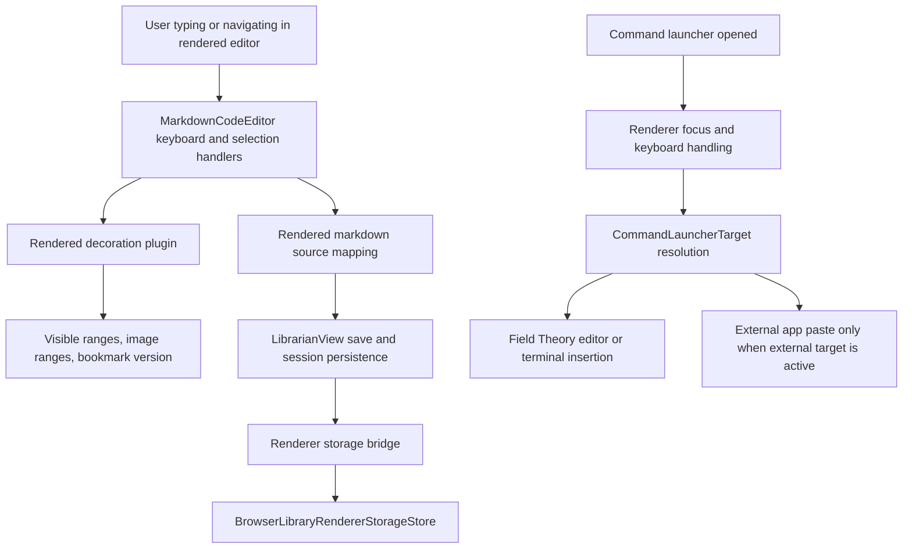

# fix: Stabilize editor quality regressions

## Summary

This plan turns the June 8 editor-quality scratchpad into a focused implementation pass for Field Theory's Mac Library experience. It targets typing and scrolling latency, rendered markdown cursor behavior, state persistence, command launcher focus/paste routing, drawing startup, and image rendering stability.

The work should be executed characterization-first. Most failures already have nearby unit or integration tests, so the implementer should add failing coverage for each reported regression before changing behavior.

## Progress

- [x] 2026-06-08: U1 characterization trace landed for rendered editor edits, save scheduling, editor-session persistence scheduling, and scroll/session restoration debug events.
- [x] 2026-06-08: Focused verification passed: `npm test -- src/components/__tests__/LibrarianView.test.tsx` from `mac-app` with 106/106 tests passing.
- [x] 2026-06-08: U2 reduced image-range churn by mapping stable image ranges through ordinary edits and rescanning only when changed old/new lines contain image markdown.
- [x] 2026-06-08: Focused verification passed: `npm test -- src/components/__tests__/MarkdownCodeEditor.test.tsx`, targeted rendered `LibrarianView` tests, and `npm run typecheck`.
- [x] 2026-06-08: U3 regression coverage added for ArrowDown into an existing empty list item, Command+Right on styled rendered text, and paragraph selection across inline syntax.
- [x] 2026-06-08: U3 heading/quote Backspace boundary guard landed so rendered body-start deletes do not eat hidden block syntax.
- [x] 2026-06-08: Focused verification passed: targeted heading-delete `LibrarianView` test, `MarkdownCodeEditor.test.tsx`, and `npm run typecheck`.
- [x] 2026-06-08: U4 sidebar persistence fix landed: popped-out document windows read shared sidebar preferences but no longer write transient expansion state back to shared storage.
- [x] 2026-06-08: Focused verification passed: popped-out `LibrarianView` tests and `npm run typecheck`.
- [x] 2026-06-08: Saved locally to the root staging checkout for manual testing.
- [x] 2026-06-08: U4 cursor/session startup hydration coverage added for Browser Library host boot before React reads renderer storage.
- [x] 2026-06-08: U4 document-window bounds coverage added for restoring saved bounds and reporting move/resize changes for persistence.
- [x] 2026-06-08: Focused U4 verification passed: `npm test -- src/__tests__/browserLibraryApp.test.tsx electron/main/documentWindow.test.ts` and `npm run typecheck`.
- [x] 2026-06-08: U5 panel warning fix landed: stale helper timing now clears when later helper requests succeed before React mounts.
- [x] 2026-06-08: U5 verification passed for launcher reset/focus, Tab panel switching, Field Theory/external invocation target resolution, and recovered panel helper state.
- [x] 2026-06-08: U6 rendered `/draw` coverage added: Enter opens the Draw dialog without replacing the rendered editor, and saving inserts portable markdown in place.
- [x] 2026-06-08: U6 verification passed for slash command parsing, drawing rendering/edit affordance, image-range stability, portable image copy, command-launcher image insertion, and `npm run typecheck`.
- [x] 2026-06-08: U7 automated scenario coverage added for a large rendered markdown fixture covering repeated typing, Enter-style insertion, ArrowDown, Command+Right, delete guarding, and hidden syntax leaks.
- [x] 2026-06-08: U7 focused verification passed for rendered editor, command-click navigation, startup hydration, launcher focus/routing, clipboard window state, and `npm run typecheck`.
- [ ] Live visual image-revisit verification remains open; the existing Browser Library helper token was expired, and no dev server was started for this pass.

---

## Problem Frame

The Library editor is close to the desired read-write surface, but small interruptions still break trust: typing can lag, Enter can produce a scroll jump, cursor movement can enter hidden markdown, the leftnav can reset while opening another document, and app state can drift after a window close or dev restart.

The command launcher has a separate focus problem. Tab and Enter should behave like launcher-local actions, and invoking an item while Field Theory is active should paste or insert into the active Field Theory surface instead of the previous external app.

---

## Requirements

### Editor Performance

- R1. Typing in rendered markdown must stay responsive while the document is large, with no avoidable synchronous full-document work on ordinary text input.
- R2. Pressing Enter in a long document must not trigger a visible scroll skip unless the caret genuinely needs to be brought into view.
- R3. The implementation must leave enough trace output to explain what happens during typing, selection movement, rendered decoration rebuilds, save scheduling, and scroll restoration.

### Rendered Markdown Editing

- R4. ArrowDown from a non-empty rendered list item into an existing empty list item must land in the empty item's body column, not on hidden marker syntax or a visually wrong position.
- R5. Command+Right in rendered mode must move to the end of the current visual line, not the end of the sentence or the beginning of the next line.
- R6. Deleting headings, list markers, links, inline formatting, and image markdown in rendered mode must not leak raw markdown syntax into the visible editor.
- R7. Paragraph highlighting in rendered mode must produce a coherent selection state without odd partial syntax reveal or stale highlight chrome.

### Library And App State

- R8. Command-click opening a document from the Library sidebar must preserve the source window's expanded folder tree and sidebar state.
- R9. Cursor display preferences and renderer-local Library preferences must hydrate from one durable source and persist after close, reopen, and dev server restart.
- R10. App window state, active surface, active document, window size, and relevant Library view state must not reset unless the user explicitly changes them.

### Command Launcher

- R11. Tab in the context launcher must cycle or enter the expected launcher items from the keyboard immediately after opening, without requiring a mouse click on visible text.
- R12. Enter on a launcher item must route into the active Field Theory editor or terminal when Field Theory is the frontmost app, and only route to the previous external app when an external app was actually the target.

### Drawing And Images

- R13. `/ draw` and the draw button must open a usable drawing surface instead of blanking the editor.
- R14. Previously visited pages with images must not visibly re-render stable image embeds unless the source content or image URL changed.

---

## Key Technical Decisions

- KTD1. Measure before optimizing typing: use the existing rendered-editor timing and command-launcher trace patterns to characterize the hot path, then remove specific repeated work. The risk is otherwise treating every lag report as a generic React performance problem.
- KTD2. Keep syntax hiding in the CodeMirror rendered editor, not in a parallel DOM editor. `MarkdownCodeEditor` already owns rendered decorations, selection normalization, and keyboard shims, so fixes should extend that contract instead of adding another editing path.
- KTD3. Persist renderer preferences through the existing renderer-storage bridge. `browser-library-renderer-storage` already centralizes allowed localStorage keys; adding another preference store would make the cursor/state bug harder to reason about.
- KTD4. Treat command launcher invocation target as a first-class routing decision. `commandLauncherTarget` already separates Field Theory markdown, Field Theory terminal, external app, and none; Enter behavior should build on that instead of reading `previousApp` directly in UI code.
- KTD5. Keep image stability separate from drawing startup. Draw blanking is an insertion/editor-state issue; image rerendering is a decoration/cache stability issue. Mixing them would make verification weak.

---

## High-Level Technical Design

The editor work should reduce unnecessary churn in `D` and make `C` exact for the reported list, heading, inline formatting, and command-arrow cases. The launcher work should keep focus inside `J` and make `K` the authoritative routing gate.

---

## Scope Boundaries

### In Scope

- Rendered markdown typing, navigation, deletion, selection, and image/drawing behavior in the Mac Library editor.
- Library sidebar expansion persistence for command-click document opening.
- Renderer preference and app/window state persistence that affects the reported cursor and restart behavior.
- Context launcher Tab and Enter behavior when Field Theory is active.
- Focused tests around the affected helpers, React components, and Electron main-process routing.

### Deferred to Follow-Up Work

- A broad redesign of the rendered markdown editor.
- New UI for performance diagnostics beyond trace and test hooks needed to prove this pass.
- New command launcher modes unrelated to Tab cycling or Enter routing.
- Production telemetry dashboards for editor latency.

---

## Implementation Units

### U1. Characterize Rendered Editor Typing And Scroll Work

- **Goal:** Make the typing, Enter, save scheduling, decoration rebuild, and scroll-restore path observable enough to isolate the lag and skip causes.
- **Requirements:** R1, R2, R3.
- **Dependencies:** None.
- **Files:** `mac-app/src/utils/renderedMarkdownEditor.ts`, `mac-app/src/components/MarkdownCodeEditor.tsx`, `mac-app/src/components/LibrarianView.tsx`, `mac-app/src/components/__tests__/MarkdownCodeEditor.test.tsx`, `mac-app/src/components/__tests__/LibrarianView.test.tsx`, `mac-app/src/utils/__tests__/renderedMarkdownEditor.test.ts`.
- **Approach:** Extend existing timing/debug hooks instead of inventing new diagnostics. Capture when input starts, when CodeMirror transactions dispatch, when rendered decorations rebuild, when pending saves schedule or flush, and when scroll restoration writes `scrollTop`.
- **Execution note:** Start with characterization tests for ordinary typing and Enter in rendered mode before changing performance-sensitive code.
- **Patterns to follow:** `renderedMarkdownEditorTimingEnabled`, `emitRenderedMarkdownEditorTiming`, `recordRenderedEditorDebug`, and existing scroll diagnostics tests.
- **Test scenarios:** Typing one plain character in rendered mode records an input/decorations timing path without forcing a full file-mode transition. Pressing Enter in a long rendered document records only the necessary scroll/focus work and preserves the caret line. A pending rendered save plus Enter does not trigger duplicate scroll restoration. Debug mode off keeps production behavior quiet.
- **Verification:** The implementer can point to a trace or test fixture that explains every major operation triggered by one keystroke.

### U2. Reduce Rendered Decoration Churn On Typing And Selection

- **Goal:** Remove avoidable full-document decoration and image-range work from ordinary typing and selection movement.
- **Requirements:** R1, R3, R14.
- **Dependencies:** U1.
- **Files:** `mac-app/src/components/MarkdownCodeEditor.tsx`, `mac-app/src/components/__tests__/MarkdownCodeEditor.test.tsx`, `mac-app/src/utils/imageCache.ts`, `mac-app/src/utils/imageCache.test.ts`.
- **Approach:** Keep decoration rebuilds scoped to visible ranges plus stable image ranges, and only recompute whole-document image ranges when markdown image lines actually change. Treat selection-only updates as a narrow syntax-visibility update, not as a reason to refresh every rendered image widget.
- **Execution note:** Add a regression test that counts or observes decoration rebuild inputs before optimizing.
- **Patterns to follow:** `createRenderedMarkdownEditorPresentationExtension`, `getRenderedMarkdownImageLineRanges`, `buildRenderedMarkdownEditorDecorationsForRanges`, and `imageCache` tests.
- **Test scenarios:** A plain text insertion outside an image line does not recompute image line ranges for the whole document. Selection movement over a normal paragraph does not recreate image widgets. Editing an image markdown line does refresh the relevant image range. Revisiting a page with the same image source reuses the stable rendered image path instead of showing a blank or reload flash.
- **Verification:** Large-document typing is measurably lighter in the trace from U1, and image embeds remain stable across navigation away and back.

### U3. Fix Rendered List, Command-Arrow, Delete, And Highlight Semantics

- **Goal:** Keep the rendered caret and visible selection on editable text, never hidden markdown syntax, for the reported list, command-arrow, delete, and paragraph highlight cases.
- **Requirements:** R4, R5, R6, R7.
- **Dependencies:** U1.
- **Files:** `mac-app/src/components/MarkdownCodeEditor.tsx`, `mac-app/src/utils/renderedMarkdownEditor.ts`, `mac-app/src/components/__tests__/MarkdownCodeEditor.test.tsx`, `mac-app/src/utils/__tests__/renderedMarkdownEditor.test.ts`.
- **Approach:** Tighten the existing source-to-rendered mapping helpers and CodeMirror key handlers. Command+Right should trust CodeMirror's visual line boundary but clamp away from hidden syntax and next-line markers. Deletion and highlight normalization should preserve the rendered exception for editable link aliases while blocking accidental heading/list/image source reveal.
- **Execution note:** Add failing tests for the exact scratchpad cases before editing the helpers.
- **Patterns to follow:** `getRenderedMarkdownSelectionOutsideHiddenSyntax`, `getRenderedMarkdownVerticalNavigationEdit`, `getRenderedMarkdownCommandArrowSelection`, `handleRenderedMarkdownEditorCommandArrow`, and the rendered list layout tests.
- **Test scenarios:** ArrowDown from `- full item` into a following `- ` lands at the empty list body offset. Command+Right from the middle of a rendered visual line lands at the same visual line end. Command+Right at the end of a line does not jump to the next line's first body character unless native CodeMirror movement already chose that line. Deleting an H2 marker or inline formatting keeps visible text rendered and hides raw markdown. Selecting a paragraph spanning styled inline markdown keeps the selection visually coherent and does not expose raw delimiters.
- **Verification:** The existing rendered markdown test suite gains coverage for all four reported navigation/visibility regressions and passes without weakening syntax-hiding behavior.

### U4. Preserve Sidebar, Cursor, Window, And App State Through Open And Restart

- **Goal:** Make Library state survive command-click document opening, window close/reopen, and dev server restart without conflicting preference sources.
- **Requirements:** R8, R9, R10.
- **Status:** Mostly complete for renderer-storage startup hydration, sidebar command-click preservation, and standalone document-window bounds. Broader active-surface restart coverage remains part of U7.
- **Dependencies:** None.
- **Files:** `mac-app/src/browser-library.tsx`, `mac-app/src/components/LibrarianView.tsx`, `mac-app/electron/preload.ts`, `mac-app/electron/shared/browserLibraryRendererStorage.ts`, `mac-app/electron/main/browserLibraryRendererStorageStore.ts`, `mac-app/electron/main/preferences.ts`, `mac-app/electron/main/clipboardHistoryWindow.ts`, `mac-app/electron/main/documentWindow.test.ts`, `mac-app/src/__tests__/browserLibraryApp.test.tsx`, `mac-app/src/components/__tests__/LibrarianView.test.tsx`, `mac-app/electron/main/browserLibraryRendererStorageStore.test.ts`, `mac-app/electron/main/clipboardHistoryWindow.test.ts`.
- **Approach:** Audit every localStorage key and preference field involved in Library tree expansion, cursor style, sidebar state, active document, and window bounds. Then route missing keys through `BROWSER_LIBRARY_RENDERER_STORAGE_KEYS` or existing `Preferences` fields, depending on whether the state is renderer-local or main-process window state.
- **Execution note:** Characterize the current persistence split before adding keys or changing hydration order.
- **Patterns to follow:** `hydrateBrowserLibraryRendererStorageBeforeAppBoot`, `installBrowserLibraryRendererStorageForwarding`, `BrowserLibraryRendererStorageStore`, `pickSavedBoundsByKey`, and app-mode window focus tests.
- **Test scenarios:** Command-click opening a document in a second window keeps the original window's expanded folder tree unchanged. Cursor style and block opacity changes persist through renderer boot hydration. Window size and active Library surface restore from preferences without resetting the renderer. A dev-server restart hydrates the same persisted Library keys before React reads localStorage.
- **Verification:** State persistence tests prove one durable source per state kind, and no new unregistered Library localStorage keys are introduced.

### U5. Repair Command Launcher Keyboard Focus And Invocation Routing

- **Goal:** Make Tab and Enter work from the keyboard immediately after launcher open, with Enter inserting into the active Field Theory surface when Field Theory is active.
- **Requirements:** R11, R12.
- **Status:** Complete for the planned focus/routing contract and false panel warning. Existing tests cover reset-before-focus, focus-input events after show/preview blur, Tab default-panel cycling, and invocation target resolution. New coverage prevents old failed Browser helper requests from showing a reconnect warning after later successful helper requests.
- **Dependencies:** None.
- **Files:** `mac-app/src/command-launcher.tsx`, `mac-app/src/commandLauncherUtils.ts`, `mac-app/electron/main/commandLauncherWindow.ts`, `mac-app/electron/main/commandLauncherTarget.ts`, `mac-app/electron/main/commandClipboard.ts`, `mac-app/src/__tests__/commandLauncherUtils.test.ts`, `mac-app/electron/main/commandLauncherWindow.test.ts`, `mac-app/electron/main/commandLauncherTarget.test.ts`, `mac-app/electron/main/superPasteRouting.test.ts`.
- **Approach:** Treat launcher focus as part of the show/reset contract, not as a side effect of clicking visible text. Then make Enter invocation ask `resolveCommandLauncherInvocationTarget` whether the destination is Field Theory markdown, Field Theory terminal, external app, or none.
- **Execution note:** Add tests for keyboard-only launcher use before changing invocation behavior.
- **Patterns to follow:** `focusLauncherInput`, `command-launcher:reset`, `command-launcher:focus-input`, `resolveCommandLauncherInvocationTarget`, and existing Super Paste routing tests.
- **Test scenarios:** After launcher reset, the input receives focus and Tab cycles the default panel or highlighted item without mouse interaction. Tab does not get swallowed by a non-input focused element. Enter on a portable command while Field Theory markdown is active inserts into the editor. Enter while a Field Theory terminal is focused routes to the terminal. Enter while an external app is active still pastes to that external target. Enter with no valid target shows a launcher-local error instead of pasting to a stale previous app.
- **Verification:** Keyboard-only launcher flows are covered in renderer and main-process tests, and stale `previousApp` state cannot override the active Field Theory target.

### U6. Fix Draw Startup And Rendered Image Revisit Stability

- **Goal:** Make `/ draw`, the draw button, editing an existing drawing, and revisiting image-heavy pages stable.
- **Requirements:** R13, R14.
- **Status:** Complete for the concrete `/draw` startup path and existing drawing/image-rendering unit coverage. No separate draw toolbar button exists in the current implementation path found during this pass. Full visual revisit stability remains part of U7.
- **Dependencies:** U2.
- **Files:** `mac-app/src/components/LibrarianView.tsx`, `mac-app/src/components/MarkdownCodeEditor.tsx`, `mac-app/src/utils/markdownSlashCommands.ts`, `mac-app/src/utils/markdownSlashCommands.test.ts`, `mac-app/src/components/__tests__/LibrarianView.test.tsx`, `mac-app/src/components/__tests__/MarkdownCodeEditor.test.tsx`, `mac-app/src/__tests__/figureUtils.test.ts`, `mac-app/electron/main/portableMarkdownImages.test.ts`.
- **Approach:** Separate the blank draw failure into command parsing, insertion state, dialog mount, and image-copy/save steps. Existing image rendering should use stable source ranges and cached URLs from U2 so drawing fixes do not create fresh rerender flashes.
- **Execution note:** Write one test for `/ draw` command insertion and one test for draw-button/open-existing-image behavior.
- **Patterns to follow:** `getMarkdownDrawCommandEdit`, `inlineDrawInsertion`, `handleInlineDrawSave`, `openRenderedDrawingEditor`, and portable markdown image tests.
- **Test scenarios:** Typing `/ draw` and pressing Enter opens the draw dialog with the editor content still visible behind it. Clicking the draw button opens the same dialog state. Saving a new drawing inserts portable markdown at the intended caret offset. Opening an existing drawing loads its image into the drawing surface instead of blanking. Revisiting a rendered page with unchanged image markdown does not rebuild visible image widgets.
- **Verification:** Draw flows pass from command/button through save insertion, and image revisit behavior remains stable after the draw fix.

### U7. Focused End-To-End Verification Pass

- **Goal:** Prove the combined fixes behave as one coherent Library/editor experience.
- **Requirements:** R1 through R14.
- **Status:** Complete for automated focused verification across the rendered editor, Library shell, Browser Library hydration, and launcher routing. Live visual image-revisit verification remains open because the existing Browser Library helper token was expired and this pass did not start a dev server.
- **Dependencies:** U1, U2, U3, U4, U5, U6.
- **Files:** `mac-app/src/components/__tests__/LibrarianView.test.tsx`, `mac-app/src/components/__tests__/MarkdownCodeEditor.test.tsx`, `mac-app/src/__tests__/browserLibraryApp.test.tsx`, `mac-app/electron/main/commandLauncherWindow.test.ts`, `mac-app/electron/main/commandLauncherTarget.test.ts`, `mac-app/electron/main/clipboardHistoryWindow.test.ts`.
- **Approach:** Add a small scenario-level suite that combines the behaviors most likely to regress together: rendered editing plus save scheduling, navigation between documents, app-state hydration, and launcher insertion while Field Theory is active.
- **Patterns to follow:** Existing Library view and Electron main-process tests rather than a new test framework.
- **Test scenarios:** A large markdown fixture supports repeated typing, Enter, ArrowDown, Command+Right, and delete without raw syntax leaks. Opening another document by command-click preserves sidebar expansion in the source window. Restart-style hydration restores cursor settings and active Library state. The launcher opens, accepts Tab, and routes Enter into Field Theory markdown when the editor is focused.
- **Verification:** `npm test -- src/components/__tests__/MarkdownCodeEditor.test.tsx`, focused `LibrarianView` U7 slices, `npm test -- src/__tests__/browserLibraryApp.test.tsx electron/main/commandLauncherWindow.test.ts electron/main/commandLauncherTarget.test.ts electron/main/clipboardHistoryWindow.test.ts`, and `npm run typecheck` pass. A full aggregate run of the six target files passed 347/348 tests, with the older sidebar multi-selection test timing out only in the heavy aggregate run and passing in isolation.

---

## System-Wide Impact

This plan touches the editor's performance posture, renderer preference hydration, Electron window state, and command launcher routing. Those are shared surfaces for daily use, so the implementation should stay narrow and test-driven.

The main risk is cross-surface coupling: a fix for selection movement can accidentally increase decoration churn, and a fix for launcher paste targeting can break external-app paste. The unit split keeps those risks visible.

---

## Risks And Dependencies

- **Risk:** Optimizing decoration rebuilds could leave stale rendered markdown when bookmarks, images, or syntax decorations change. **Mitigation:** keep explicit tests for doc changes, viewport changes, bookmark version changes, image-line edits, and selection movement.
- **Risk:** State persistence could become more confusing if new keys are added without being registered in the renderer-storage bridge. **Mitigation:** audit keys and add a test that rejects unregistered Library localStorage persistence.
- **Risk:** Launcher routing could over-correct and stop pasting into external apps. **Mitigation:** preserve the existing external-target tests and add Field Theory-active tests as a separate branch.
- **Risk:** The perceived typing lag may have more than one cause. **Mitigation:** land U1 first so later fixes can be evaluated against concrete timing evidence.

---

## Sources And Research

- `mac-app/src/components/MarkdownCodeEditor.tsx` contains rendered markdown decoration, image range, selection, and keyboard handling.
- `mac-app/src/utils/renderedMarkdownEditor.ts` contains rendered source mapping, caret restore, and debug/timing types.
- `mac-app/src/components/LibrarianView.tsx` owns save scheduling, edit-mode transitions, scroll restoration, draw insertion, and rendered editor mounting.
- `mac-app/src/command-launcher.tsx` owns launcher keyboard handling, focus, Tab behavior, and renderer invocation flow.
- `mac-app/electron/main/commandLauncherTarget.ts` already models the target distinction needed for Field Theory-active Enter routing.
- `mac-app/electron/shared/browserLibraryRendererStorage.ts` and `mac-app/electron/main/browserLibraryRendererStorageStore.ts` define the durable renderer-local preference bridge.
- `mac-app/electron/main/preferences.ts` and `mac-app/electron/main/clipboardHistoryWindow.ts` define main-process app/window state persistence.
