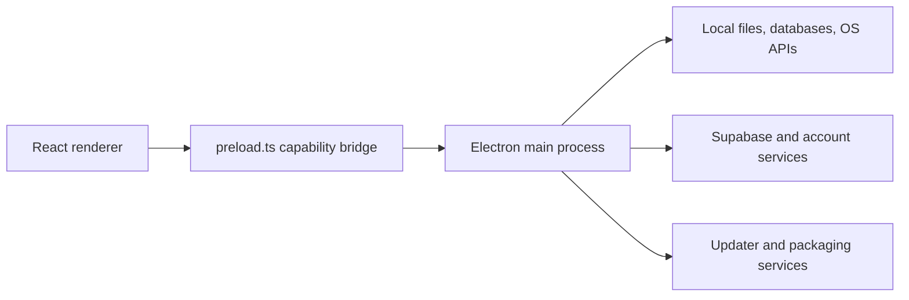
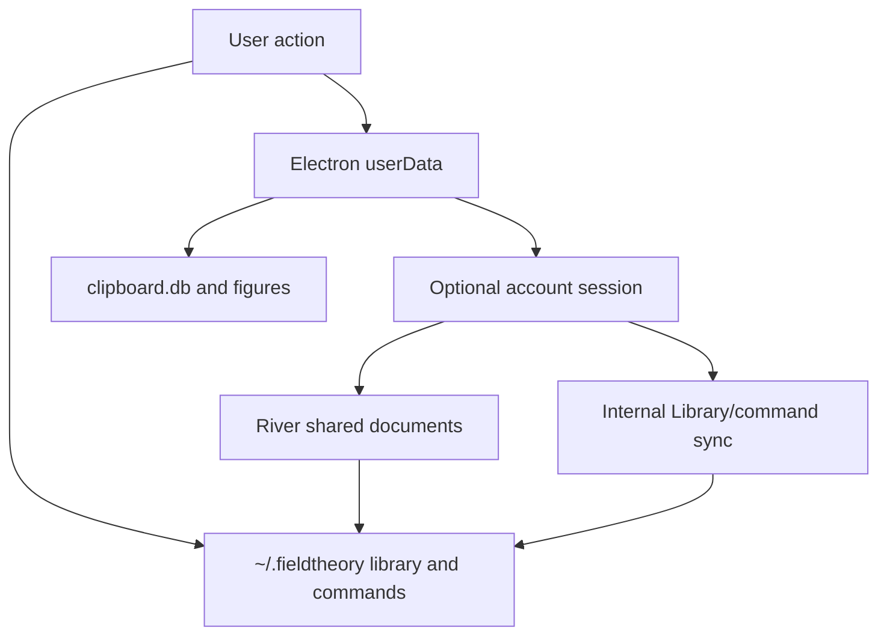
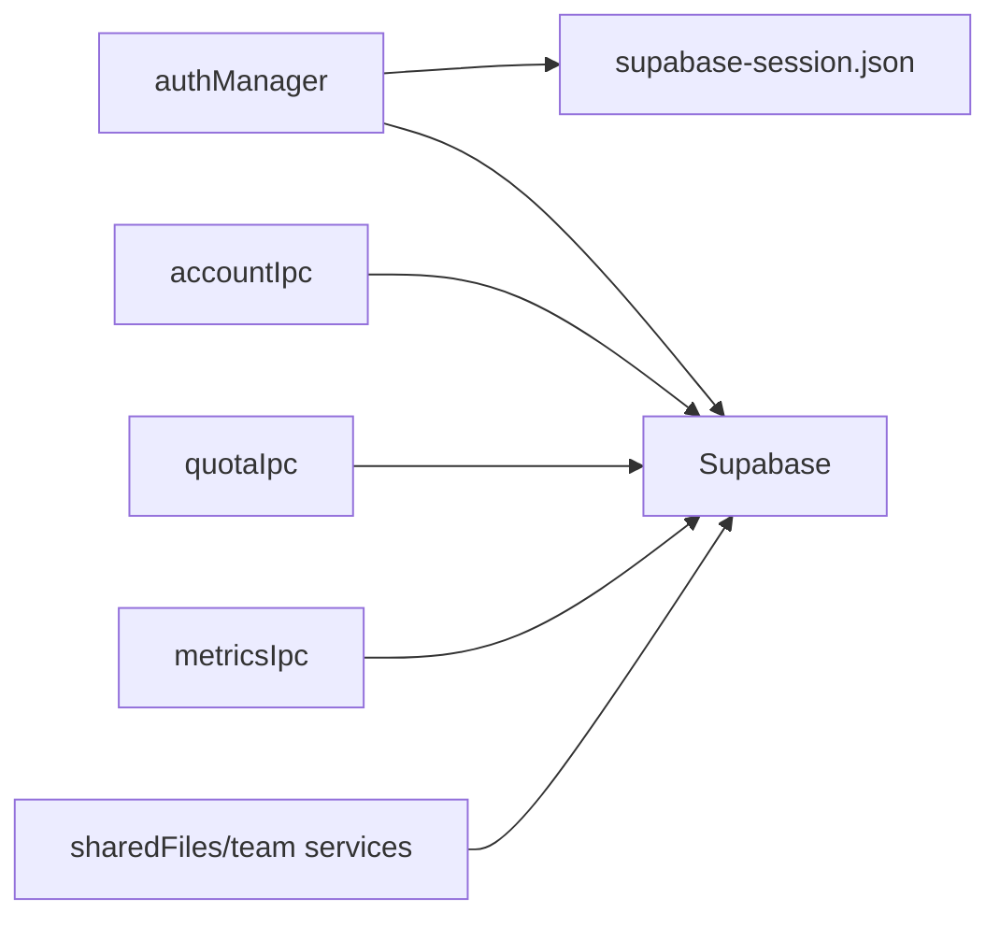
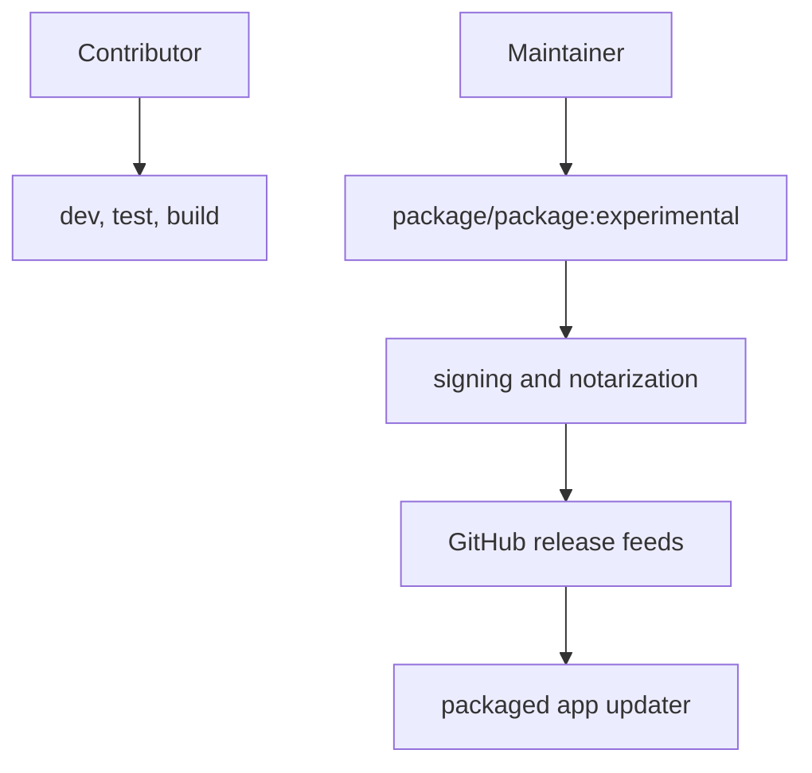

# Architecture Diagrams

Date: May 31, 2026

These diagrams summarize the current Mac app shape from code inspection. They are meant to help public readers orient themselves before reading the detailed docs.

**Renderer to main process**

**Local-first data model**

**Account-backed surfaces**

**Maintainer release boundary**

